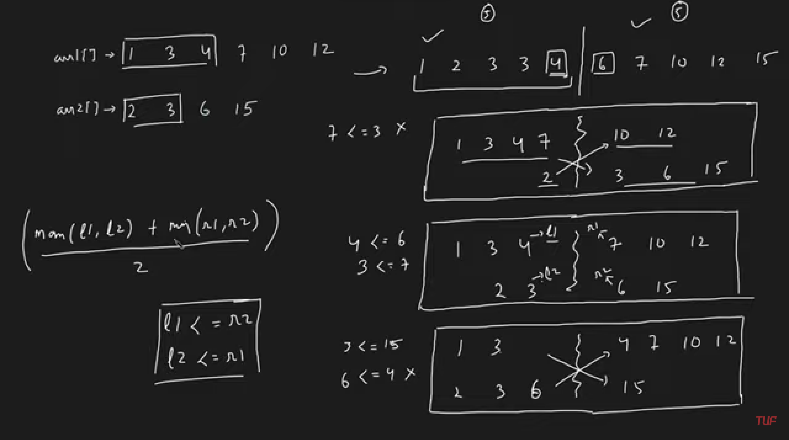

### Question
- Given two sorted arrays nums1 and nums2 of size m and n respectively, return the median of the two sorted arrays. 
- The overall run time complexity should be O(log (m+n)).

### Sample Input
    nums1 = [1,3], nums2 = [2]
    nums1 = [1,2], nums2 = [3,4]

### Sample Output
    2.00000
    2.50000

### Solution
- First of all we will ensure, we are always partitioning the smaller arr
- Take two pointers in the smaller arr, and find the logical place where the median will be present. (total length of both arrays / 2) -> let the position be 'n'
- do binary search, we will try to partition both the arrays in such a way, that left partitions of both arrays will be lesser than right partition of both arrays
- Now make a cut1 on mid of smaller arr, to ensure we have n elements on both sides, we need n-cut1 element more on left side, cut2 will be equal to n-cut1
- now we need to mark l1,l2,r1,r2 -> l1 will be last element before cut1 is made, similarly l2 will be last element before cut2 is made
- r1 will be first element after cut1 is made, similarly r2 is first element after cut2 is made
- if(l1<=r2 && l2<=r1) i.e., all the elements to left are less than all the elements to right, then just check if total length of both arrays is even or odd
  - if odd, return the max of l1, l2 as that is the middle element\
  - else return max(l1,l2) + min(r1,r2) / 2 i.e., last element of left + first element of right /2
- else if (l1>r2), this means, we need to reduce l1 and increase r2, to do that we will shift high to cut1-1 position
- else, we need to increase l2 and decrease r1, to do that we will shift low to cut1+1 position

### Code
    public double findMedianSortedArrays(int[] nums1, int[] nums2){
        if(nums2.length> nums1.length){
            return findMedianSortedArrays(nums2, nums1);    //to ensure we are always partitioning the smaller arr first
        }

        //take two pointers in the smaller arr
        int low=0, high=nums1.length;
        int mPos= ((nums1.length+nums2.length)+1)/2;    //when we find median, it is generally the mid element from entire search space
        while (low<=high){
            int cut1= (low+high)/2;     //make cut1
            int cut2= mPos-cut1;        //the number of remaining elements will be there in cut2

            int l1= (cut1==0) ? Integer.MIN_VALUE : nums1[cut1-1];  //our l1 will be the last element before cut1 is made
            int l2= (cut2==0) ? Integer.MIN_VALUE : nums2[cut2-1];  //our l2 will be the last element before cut2 is made
            int r1= (cut1==nums1.length) ? Integer.MAX_VALUE : nums1[cut1]; //r1 will be first element after cut1 is made
            int r2= (cut2==nums2.length) ? Integer.MAX_VALUE : nums2[cut2]; //r2 will be first element after cut2 is made

            if (l1<=r2 && l2<=r1){
                if ((nums1.length + nums2.length) % 2 !=0){     //if total elements are odd
                    return Math.max(l1,l2);     //return last element from left side i.e. max one
                }else{      //if total elements are even
                    return (Math.max(l1,l2) + Math.min(r1,r2))/2.0;     //max from left + min from right / 2
                }
            }
            else if (l1>r2) high=cut1-1;    //if l1 > r2, we need to reduce l1 and increase r2, so shift high
            else low=cut1+1;    //if l2 > r1, we need to increase l2 and reduce r1, so shift low
        }
        return 0.0;
    }

### Other Techniques
- Use the sorting way we use in merge sort and extra space

### Complexity
1. Time Complexity - O(log (m+n))
2. Space Complexity - O(1)