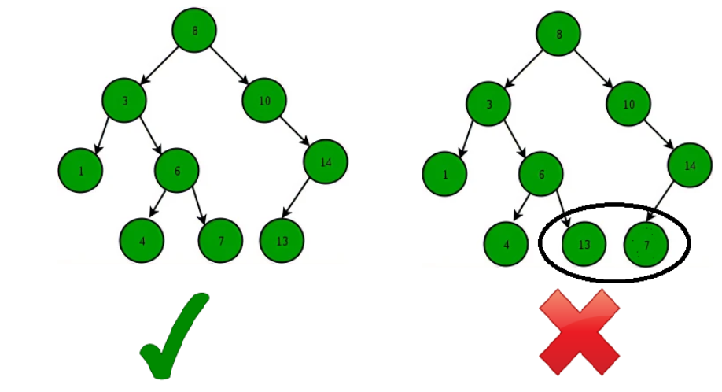

### What is a Binary Search Tree?
Binary Search Tree is a node-based binary tree data structure which has the following properties:

- The left subtree of a node contains only nodes with keys lesser than the node’s key.
- The right subtree of a node contains only nodes with keys greater than the node’s key.
- The left and right subtree each must also be a binary search tree.

There must be no duplicate nodes(BST may have duplicate values with different handling approaches)

### Handling approach for Duplicate values in the Binary Search tree:
- You can not allow the duplicated values at all.
- We must follow a consistent process throughout i.e either store duplicate value at the left or store the duplicate value at the right of the root, but be consistent with your approach.
- We can keep the counter with the node and if we found the duplicate value, then we can increment the counter

### Applications
A BST supports operations like search, insert, delete, floor, ceil, greater, smaller, etc in O(h) time where h is height of the BST. To keep height less, self balancing BSTs (like AVL and Red Black Trees) are used in practice. These Self-Balancing BSTs maintain the height as O(Log n). Therefore all of the above mentioned operations become O(Log n). Together with these, BST also allows sorted order traversal of data in O(n) time.

- A Self-Balancing Binary Search Tree is used to maintain sorted stream of data. For example, suppose we are getting online orders placed and we want to maintain the live data (in RAM) in sorted order of prices. For example, we wish to know number of items purchased at cost below a given cost at any moment. Or we wish to know number of items purchased at higher cost than given cost.
- A Self-Balancing Binary Search Tree is used to implement doubly ended priority queue. With a Binary Heap, we can either implement a priority queue with support of extractMin() or with extractMax(). If we wish to support both the operations, we use a Self-Balancing Binary Search Tree to do both in O(Log n)
- There are many more algorithm problems where a Self-Balancing BST is the best suited data structure, like count smaller elements on right, Smallest Greater Element on Right Side, etc. 
- One of the most common use cases of BSTs is searching for a particular element in the tree. 
- A BST can be used to sort a large dataset. By inserting the elements of the dataset into a BST and then performing an in-order traversal, the elements will be returned in sorted order. 
- Used in Database indexing. 
- TreeMap and TreeSet are two  data structures that are internally implemented using self-balancing BSTs, more formally a Red-Black Tree. 
- BSTs can be used to implement symbol tables, which are used to store data such as variable and function names in a programming language. 

### Advantages of Binary Search Tree:
- BST is fast in insertion and deletion when balanced. It is fast with a time complexity of O(log n).
- BST is also for fast searching, with a time complexity of O(log n) for most operations.
- BST is efficient. It is efficient because they only store the elements and do not require additional memory for pointers or other data structures.
- We can also do range queries – find keys between N and M (N <= M).
- BST code is simple as compared to other data structures.
- BST can automatically sort elements as they are inserted, so the elements are always stored in a sorted order.
- BST can be easily modified to store additional data or to support other operations. This makes it flexible.

### Disadvantages of Binary Search Tree:
- The main disadvantage is that we should always implement a balanced binary search tree. Otherwise the cost of operations may not be logarithmic and degenerate into a linear search on an array.
- They are not well-suited for data structures that need to be accessed randomly, since the time complexity for search, insert, and delete operations is O(log n), which is good for large data sets, but not as fast as some other data structures such as arrays or hash tables.
- A BST can be imbalanced or degenerated which can increase the complexity.
- Do not support some operations that are possible with ordered data structures.
- They are not guaranteed to be balanced, which means that in the worst case, the height of the tree could be O(n) and the time complexity for operations could degrade to O(n). 