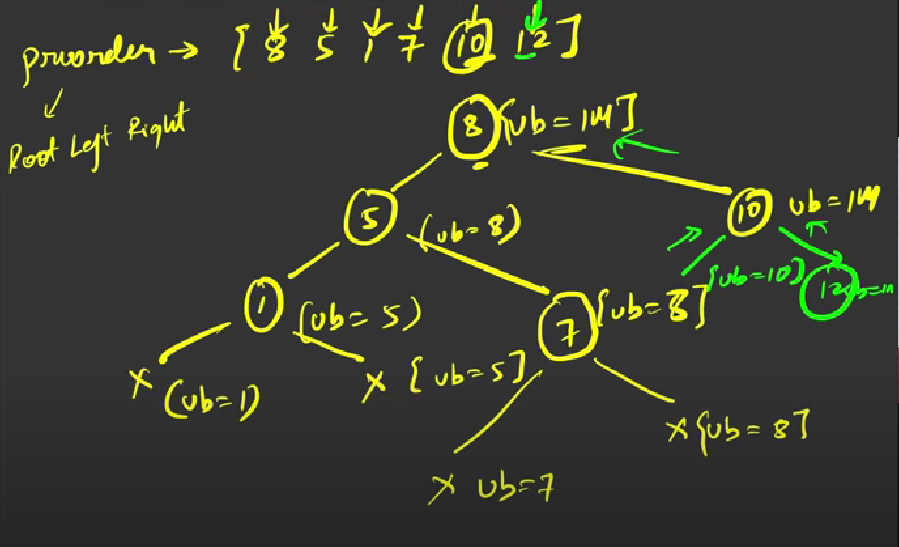

### Question
- Given an array of integers preorder, which represents the preorder traversal of a BST (i.e., binary search tree), construct the tree and return its root. 
- It is guaranteed that there is always possible to find a binary search tree with the given requirements for the given test cases. 
- A binary search tree is a binary tree where for every node, any descendant of Node.left has a value strictly less than Node.val, and any descendant of Node.right has a value strictly greater than Node.val. 
- A preorder traversal of a binary tree displays the value of the node first, then traverses Node.left, then traverses Node.right.

### Sample Input
    preorder = [8,5,1,7,10,12]
    preorder = [1,3]

### Sample Output
    [8,5,10,1,7,null,12]
    [1,null,3]

### Solution
- Initially we will add a root whose bound is Int_max & we will also maintain a count variable to not go out of bound of our preorder arr
- to the left of root the bound will be root.val
- to the right of root the bound will be the already available bound

### Code
    public static TreeNode bstFromPreorder(int[] preorder){
        return bstFromPreorderHelper(preorder, Integer.MAX_VALUE, new int[]{0});
    }

    private static TreeNode bstFromPreorderHelper(int[] preorder, int bound, int[] i) {
        if (i[0]== preorder.length || preorder[i[0]] > bound) return null;
        TreeNode root= new TreeNode(preorder[i[0]++]);
        root.left = bstFromPreorderHelper(preorder, root.val, i);
        root.right = bstFromPreorderHelper(preorder, bound, i);
        return root;
    }

### Other Techniques
- NA

### Complexity
1. Time Complexity - O(N)
2. Space Complexity - O(1) + O(N) stack space