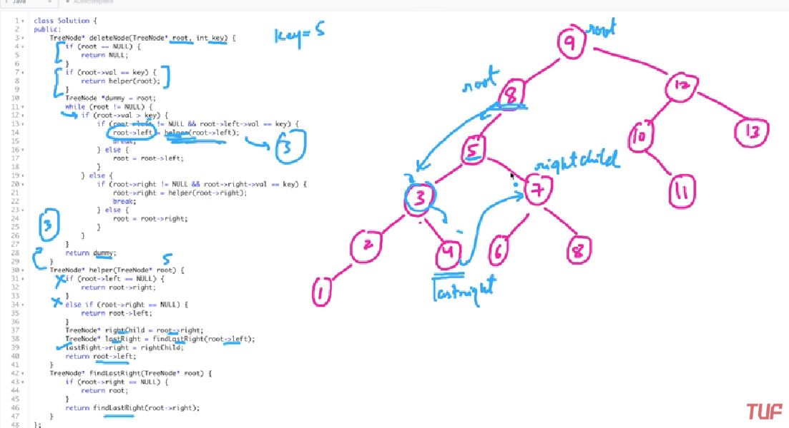

### Question
- Given a root node reference of a BST and a key, delete the node with the given key in the BST. Return the root node reference (possibly updated) of the BST. 
- Basically, the deletion can be divided into two stages:
  - Search for a node to remove. 
  - If the node is found, delete the node.

### Sample Input
    root = [5,3,6,2,4,null,7], key = 3
    root = [5,3,6,2,4,null,7], key = 0

### Sample Output
    [5,4,6,2,null,null,7]
    [5,3,6,2,4,null,7]

### Solution
- If root is null, we can't delete anything so we will return null
- If the root.val==key then we need to delete this one so call helper function
- Traverse the tree till root is not null, if root.val > key, then key exists in the left side
- Now if the left is not null & its value is equal to key, then we need to delete the left node, then root.left will call helper function & break out else it will recurse to left side
- else if root.val < key, then key exits in right side. If right is not null & its value equal to key, then we need to delete right node, then root.right will call helper function & break out else it will recurse to right side further
- helper():
  - The helper function, if node's right is null so it simply attaches the whole left part & vice versa
  - else, it takes the right child & attaches the right child to the last right child of the left child of the node & return's node.left

### Code
    public TreeNode deleteNode(TreeNode root, int key) {
        if (root==null) return null;
        if (root.val==key) return helper(root);

        TreeNode dummy=root;
        while (root!=null){
            if (root.val>key){
                if (root.left!=null && root.left.val==key){
                    root.left = helper(root.left);
                    break;
                }else{
                    root=root.left;
                }
            }else{
                if (root.right!=null && root.right.val==key){
                    root.right = helper(root.right);
                    break;
                }else{
                    root= root.right;
                }
            }
        }
        return dummy;
    }

    private TreeNode helper(TreeNode root) {
        if (root.left==null) return root.right;
        else if (root.right==null) return root.left;
        else{
            TreeNode rightChild = root.right;
            TreeNode lastRight= findLastRight(root.left);
            lastRight.right = rightChild;
            return root.left;
        }
    }

    private TreeNode findLastRight(TreeNode root) {
        if (root.right==null) return root;
        return findLastRight(root.right);
    }

### Other Techniques
- NA

### Complexity
1. Time Complexity - O(N)
2. Space Complexity - O(1)