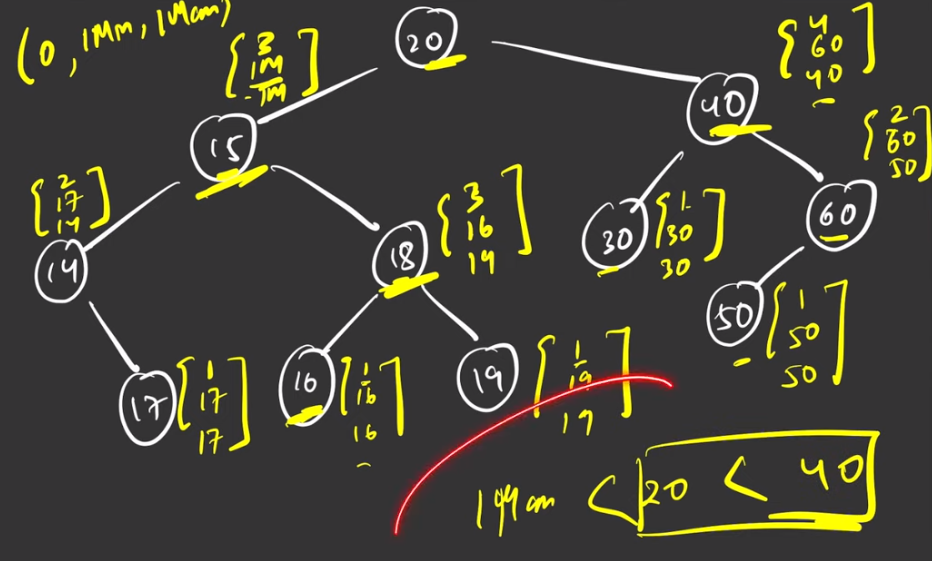

### Question
- Given a binary tree root, return the maximum sum of all keys of any sub-tree which is also a Binary Search Tree (BST). 
- Assume a BST is defined as follows:
  - The left subtree of a node contains only nodes with keys less than the node's key. 
  - The right subtree of a node contains only nodes with keys greater than the node's key. 
  - Both the left and right subtrees must also be binary search trees.

### Sample Input
    root = [1,4,3,2,4,2,5,null,null,null,null,null,null,4,6]
    root = [4,3,null,1,2]

### Sample Output
    20
    2

### Solution
- We will create a new DS called NodeValue which will store the minVal, maxVal & maxSum till now in the child nodes of a particular node
- to get maxSumBST in the BT, we first need to check if a particular tree is BST or not. In BST, all left child are less than root & right child are greater than root
- We will do a postorder like traversal, go to the leftmost node, it has no child, so it gets maxVal=Integer.MIN_VAL & minVal=Integer.MAX_VAL & maxSum=0 from both sides
- Now, l.maxVal < node.val && node.val < r.minVal, i.e., our current node is greater than the greatest of the left side & lesser than the smallest of right side, which means this is a valid BST
- so our max will become => l.maxSum + r.maxSum + node.val
- and the current node's NodeValue will contain max of current node & right's max, min of current node's & left's min, and sum of l.maxSum + r.maxSum + node.val
- But if it is not a valid BST, so we need to ignore this side for the other parent nodes, to do that we will simply return max as Integer.MAX_VAL, min as Integer.MIN_VAL & max of left & right sum

### Code
    static class NodeValue{
        public int maxSum, minVal, maxVal;
        public NodeValue(int max, int min, int maxSum){
            this.maxSum= maxSum;
            this.minVal=min;
            this.maxVal= max;
        }
    }

    int max=0;
    public int maxSumBST(TreeNode root){
        maxSumBSTHelper(root);
        return max;
    }

    private NodeValue maxSumBSTHelper(TreeNode root) {
        if (root==null){
            return new NodeValue(Integer.MIN_VALUE, Integer.MAX_VALUE, 0);
        }
        NodeValue l= maxSumBSTHelper(root.left);
        NodeValue r = maxSumBSTHelper(root.right);

        if (l.maxVal < root.val && root.val < r.minVal){
            max = Math.max(max, root.val+l.maxSum+r.maxSum);
            return new NodeValue(Math.max(root.val, r.maxVal), Math.min(root.val, l.minVal), root.val+l.maxSum + r.maxSum);
        }

        return new NodeValue(Integer.MAX_VALUE, Integer.MIN_VALUE, Math.max(l.maxSum, r.maxSum));
    }

### Other Techniques
- NA

### Complexity
1. Time Complexity - O(N)
2. Space Complexity - O(1)