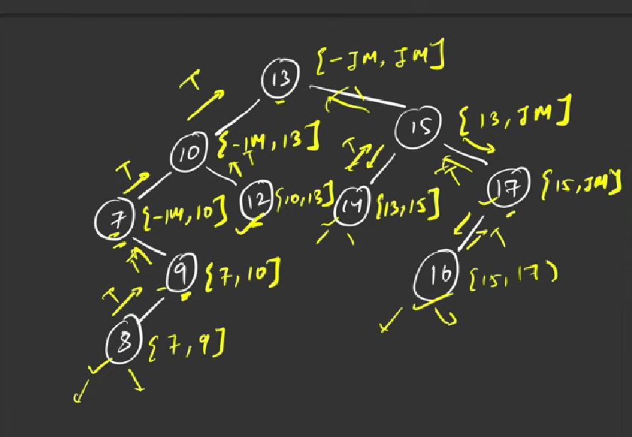

### Question
- Given the root of a binary tree, determine if it is a valid binary search tree (BST). 
- A valid BST is defined as follows:
  - The left 
  - subtree 
  - of a node contains only nodes with keys less than the node's key. 
  - The right subtree of a node contains only nodes with keys greater than the node's key. 
  - Both the left and right subtrees must also be binary search trees.

### Sample Input
    root = [2,1,3]
    root = [5,1,4,null,null,3,6]

### Sample Output
    true
    false

### Solution
- We will pass a range of values that a node can be in, at each recursion call
- if node's value goes out of the range, we return false
- at the right of a node, range will be from [min, node.val] & on the right side of node, range will be from [node.val, max]

### Code
    public static boolean isValidBST(TreeNode root){
        return checkBST(root, Long.MIN_VALUE, Long.MAX_VALUE);
    }

    private static boolean checkBST(TreeNode node, long min, long max) {
        if (node==null) return true;
        if (node.val <= min || node.val >= max) return false;

        return checkBST(node.left, min, node.val) && checkBST(node.right, node.val, max);
    }

### Other Techniques
- NA

### Complexity
1. Time Complexity - O(N)
2. Space Complexity - O(N) stack space