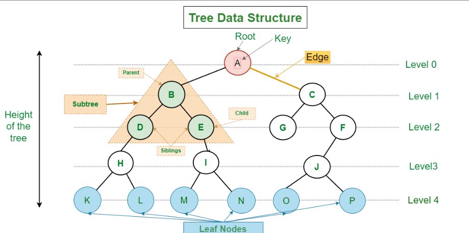
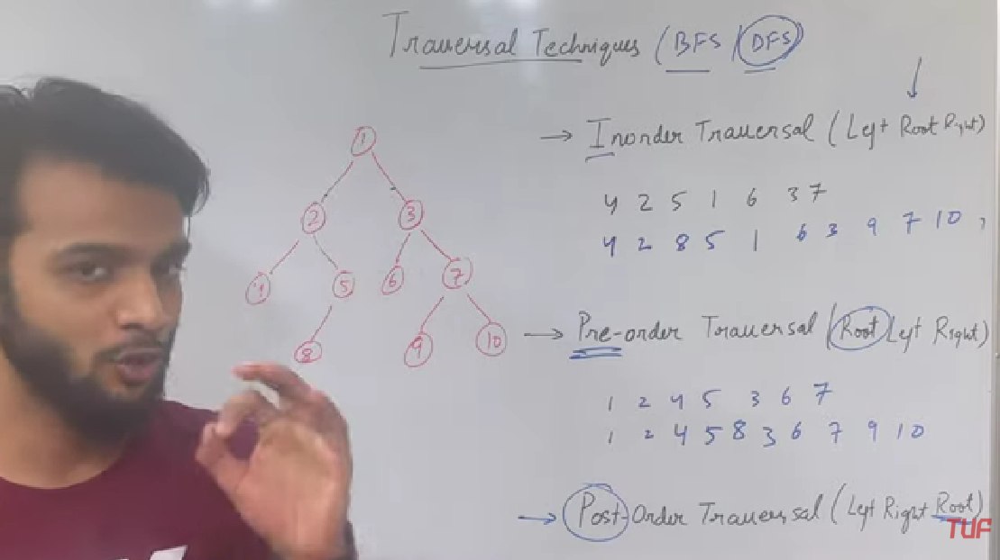
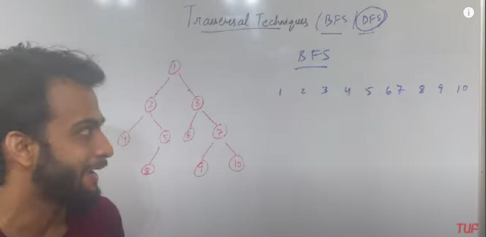

### What is a Tree DS?
A tree data structure is a hierarchical structure that is used to represent and organize data in a way that is easy to navigate and search. It is a collection of nodes that are connected by edges and has a hierarchical relationship between the nodes.

The topmost node of the tree is called the root, and the nodes below it are called the child nodes. Each node can have multiple child nodes, and these child nodes can also have their own child nodes, forming a recursive structure.

### Basic Terminologies In Tree Data Structure:
1. Parent Node: The node which is a predecessor of a node is called the parent node of that node. {B} is the parent node of {D, E}.
2. Child Node: The node which is the immediate successor of a node is called the child node of that node. Examples: {D, E} are the child nodes of {B}. 
3. Root Node: The topmost node of a tree or the node which does not have any parent node is called the root node. {A} is the root node of the tree. A non-empty tree must contain exactly one root node and exactly one path from the root to all other nodes of the tree. 
4. Leaf Node or External Node: The nodes which do not have any child nodes are called leaf nodes. {K, L, M, N, O, P} are the leaf nodes of the tree. 
5. Ancestor of a Node: Any predecessor nodes on the path of the root to that node are called Ancestors of that node. {A,B} are the ancestor nodes of the node {E} 
6. Descendant: Any successor node on the path from the leaf node to that node. {E,I} are the descendants of the node {B}. 
7. Sibling: Children of the same parent node are called siblings. {D,E} are called siblings.
Level of a node: The count of edges on the path from the root node to that node. The root node has level 0. 
8. Internal node: A node with at least one child is called Internal Node. 
9. Neighbour of a Node: Parent or child nodes of that node are called neighbors of that node. 
10. Subtree: Any node of the tree along with its descendant.

### Types of Trees
1. Binary tree: In a binary tree, each node can have a maximum of two children linked to it. Some common types of binary trees include full binary trees, complete binary trees, balanced binary trees, and degenerate or pathological binary trees. 
2. Ternary Tree: A Ternary Tree is a tree data structure in which each node has at most three child nodes, usually distinguished as “left”, “mid” and “right”. 
3. N-ary Tree or Generic Tree: Generic trees are a collection of nodes where each node is a data structure that consists of records and a list of references to its children(duplicate references are not allowed). Unlike the linked list, each node stores the address of multiple nodes.

### Binary tree
The Binary tree means that the node can have maximum two children. Here, binary name itself suggests that 'two'; therefore, each node can have either 0, 1 or 2 children.
- At each level of i, the maximum number of nodes is 2i.
- The height of the tree is defined as the longest path from the root node to the leaf node. The tree which is shown above has a height equal to 3. Therefore, the maximum number of nodes at height 3 is equal to (1+2+4+8) = 15. In general, the maximum number of nodes possible at height h is (20 + 21 + 22+….2h) = 2h+1 -1.
- The minimum number of nodes possible at height h is equal to h+1.
- If the number of nodes is minimum, then the height of the tree would be maximum. Conversely, if the number of nodes is maximum, then the height of the tree would be minimum.

### Types of Binary tree
1. Full/Strict BT - The full binary tree is also known as a strict binary tree. The tree can only be considered as the full binary tree if each node must contain either 0 or 2 children. The full binary tree can also be defined as the tree in which each node must contain 2 children except the leaf nodes.
2. Complete BT - The complete binary tree is a tree in which all the nodes are completely filled except the last level. In the last level, all the nodes must be as left as possible. In a complete binary tree, the nodes should be added from the left.
3. Perfect - A tree is a perfect binary tree if all the internal nodes have 2 children, and all the leaf nodes are at the same level.
4. Degenerate - The degenerate binary tree is a tree in which all the internal nodes have only one children.
5. Balanced - The balanced binary tree is a tree in which both the left and right trees differ by atmost 1. For example, AVL and Red-Black trees are balanced binary tree.

### Tree Traversal Techniques
Traversing a tree means visiting every node in the tree. You might, for instance, want to add all the values in the tree or find the largest one. For all these operations, you will need to visit each node of the tree.
1. Depth First Search
   1. Inorder traversal
      - First, visit all the nodes in the left subtree
      - Then the root node
      - Visit all the nodes in the right subtree

   2. Preorder Traversal
      - Visit root node
      - Visit all the nodes in the left subtree
      - Visit all the nodes in the right subtree

   3. Postorder Traversal
      - Visit all the nodes in the left subtree
      - Visit all the nodes in the right subtree
      - Visit the root node
2. Breadth first Search or Level Order Traversal - Level Order Traversal technique is defined as a method to traverse a Tree such that all nodes present in the same level are traversed completely before traversing the next level.

