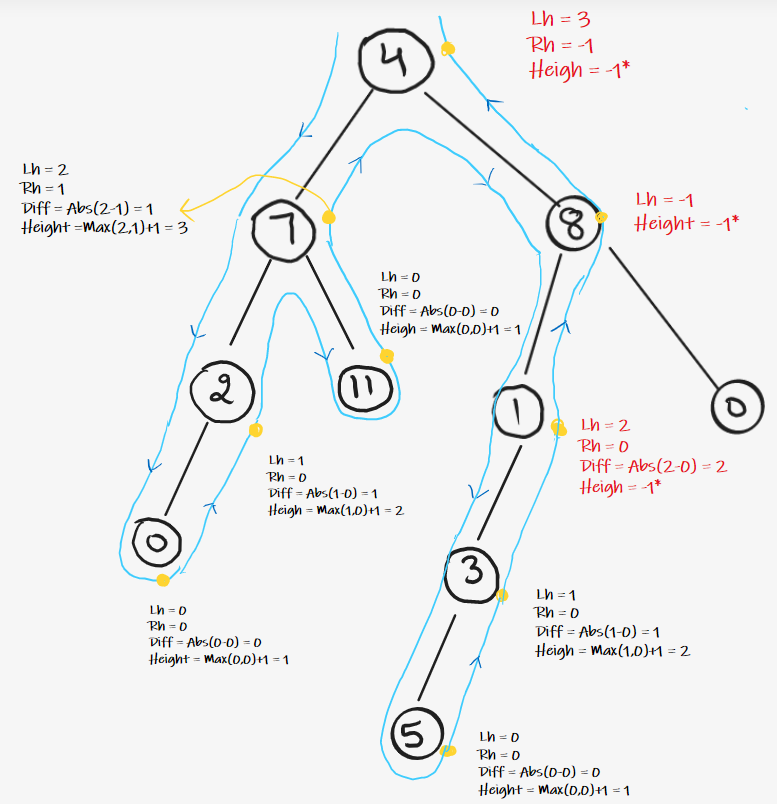

### Question
- Given a binary tree, determine if it is height-balanced
- All Nodes in the tree have an Absolute Difference of Left Height & Right Height not more than 1.

### Sample Input
    root = [3,9,20,null,null,15,7]
    root = [1,2,2,3,3,null,null,4,4]

### Sample Output
    true
    false

### Solution
- So, the idea is to use post-order traversal. Since, in postorder traversal, we first traverse the left and right subtrees and then visit the parent node, similarly instead of calculating the height of the left subtree and right subtree every time at the root node, use post-order traversal, and keep calculating the heights of the left and right subtrees and perform the validation.
- Start traversing the tree recursively and do work in Post Order. 
- For each call, calculate the height of the root node, and return it to previous calls.
- Simultaneously, in the Post Order of every node , Check for condition of balance as information of left and right subtree height is available. 
- If it is balanced , simply return height of current node and if not then return -1. 
- Whenever the subtree result is -1 , simply keep on returning -1.

### Code
    public static boolean isBalanced(TreeNode root){
        return dfsHeight(root) != -1;
    }

    private static int dfsHeight(TreeNode root) {
        if (root==null) return 0;

        int left= dfsHeight(root.left);
        if (left==-1) return -1;
        int right= dfsHeight(root.right);
        if (right==-1) return -1;

        if (Math.abs(left-right)>1) return -1;
        return Math.max(left, right)+1;
    }

### Edge Cases
- NA

### Other Techniques
- NA

### Complexity
1. Time Complexity - O(N)
2. Space Complexity - O(1) + O(H) stack space