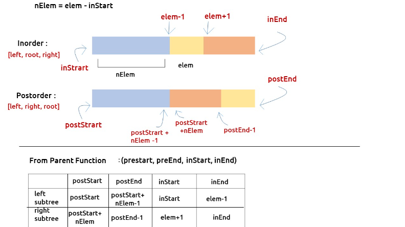

### Question
- Given two integer arrays inorder and postorder where inorder is the inorder traversal of a binary tree and postorder is the postorder traversal of the same tree, construct and return the binary tree.

### Sample Input
    inorder = [9,3,15,20,7], postorder = [9,15,7,20,3]
    inorder = [-1], postorder = [-1]

### Sample Output
    [3,9,20,null,null,15,7]
    [-1]

### Solution
- Inorder traversal is a special traversal that helps us to identify a node and its left and right subtree. Postorder traversal always gives us the root node as its last element.

- Here 10 (last element of postorder) is the root element. So we can find its index in the inorder traversal(say elem). The left subtree of the root will be present to the left side of inorder whereas the right subtree of root will be present on the right side of elem in the inorder traversal
- We can define a recursive function that creates one node at a time. First, we create the root node, and then we can take the help of recursion to create its left and right subtrees. In order to make recursion work, we need to provide the correct inorder and postorder traversal of the subtree for every recursive call.
- To make more efficient function calls we can use variables (inStart, inEnd) and (postStart and postEnd) in order to point to the start and end of the inorder and postorder traversal respectively, and avoid copying of arrays. 
- Next, we need to figure out how we are going to search the root index in the inorder traversal. For this, we have two options: Linear Search and Hashmaps. We will choose the second one because it will return us the index in constant time. Before making the first recursive call, we will simply add all the (value, index) pairs to a map and pass it to our recursive function.
- Now the main task left is to pass the correct postStart, postEnd, inStart, inEnd to the respective recursive calls for the left and right subtree. We can calculate the number of elements in the left subtree from the root index, say nElems (elem – InStart, where elem is the index of root in inorder traversal). As inorder is [left, root, right] and postorder is [left, right, root] the number of elements (nElems) will easily tell us the preorder and inorder traversal of the subtrees according to the following table:
  
- The base case will be when inStart> inEnd or postStart > postEnd, in that case, we can simply return NULL.

### Code
     public static TreeNode buildTree(int[] inorder, int[] postorder){
        if (inorder == null || postorder == null || inorder.length != postorder.length) return null;
        HashMap<Integer, Integer> map= new HashMap<>();
        for (int i = 0; i < inorder.length; i++) {
            map.put(inorder[i],i);
        }

        return buildTreeRoot(inorder, 0, inorder.length-1, postorder, 0, postorder.length-1, map);
    }

    private static TreeNode buildTreeRoot(int[] inorder, int inStart, int inEnd, int[] postorder, int postStart, int postEnd, HashMap<Integer, Integer> map) {
        if (postStart>postEnd || inStart>inEnd) return null;
        TreeNode root= new TreeNode(postorder[postEnd]);
        int inRoot= map.get(root.val);
        int numsLeft= inRoot - inStart;

        root.left= buildTreeRoot(inorder, inStart, inRoot-1, postorder, postStart, postStart+numsLeft-1, map);
        root.right= buildTreeRoot(inorder, inRoot+1, inEnd, postorder, postStart+numsLeft, postEnd-1, map);
        return root;
    }

### Edge Cases
- NA

### Other Techniques
- NA

### Complexity
1. Time Complexity - O(N)
2. Space Complexity - O(N)