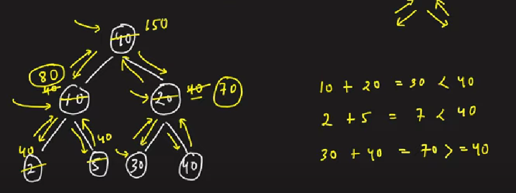

### Question
- Given a binary tree of nodes 'N', you need to modify the value of its nodes, such that the tree holds the Children Sum Property. 
- A binary tree is said to follow the children sum property if, for every node of that tree, the value of that node is equal to the sum of the value(s) of all its children nodes(left & right child)

### Sample Input
    2 35 10 2 3 5 2 -1 -1 -1 -1 -1 -1 -1 -1 
    10 5 5 -1 -1 -1 -1

### Sample Output
    One of the possible answers is : 45 35 10 32 3 8 2 -1 -1 -1 -1 -1
    Already valid: 10 5 5 -1 -1 -1 -1

### Solution
- We perform a tree traversal and check whether the current node value is greater than the sum of node values of its children. If this is the case, we simply assign its children to the same value of the current node and then recurse for the children. We do so because we are not allowed to decrement a node value. So we set the children to a large value in order to increment the parent. 
- It can happen in subsequent recursions that this child value is further changed, therefore it is necessary that when we return to a node after returning from its children, we set it to the sum of node values of its children explicitly.

### Algorithm
- We perform simple DFS traversal, if root is null, simply return
- Then at every node, we find the sum of its children
- If the sum is >= root's value, then we change root's value to the sum
- else sum < root's value, so we assign both the left child & right child the value of root
- Now we recursively go to left & right side
- After visiting the children, when we come back to the parent node, we add the values of children & update the parent's value to the sum of children explicitly

### Code
    public static void changeTree(BinaryTreeNode < Integer > root) {
        if (root==null) return;
        int child =0;
        if (root.left!=null){
            child += root.left.data;
        }
        if (root.right!=null){
            child+= root.right.data;
        }

        if (child >= root.data) root.data=child;
        else{
            if (root.left!=null) root.left.data = root.data;
            else if (root.right!=null) root.right.data = root.data;
        }

        changeTree(root.left);
        changeTree(root.right);

        int total=0;
        if (root.left!=null) total+= root.left.data;
        if (root.right!=null) total+= root.right.data;
        if (root.left!=null || root.right!=null) root.data=total;
    }

### Edge Cases
- NA

### Other Techniques
- NA

### Complexity
1. Time Complexity - O(N)
2. Space Complexity - O(N)