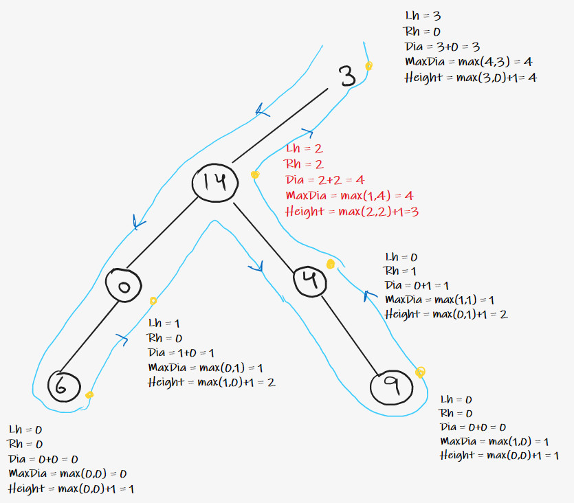

### Question
- Given the root of a binary tree, return the length of the diameter of the tree. 
- The diameter of a binary tree is the length of the longest path between any two nodes in a tree. This path may or may not pass through the root. 
- The length of a path between two nodes is represented by the number of edges between them.

### Sample Input
    root = [1,2,3,4,5]
    root = [1,2]

### Sample Output
    3
    1

### Solution
- The idea is to consider every node as a Curving Point in diameter. For our understanding, we can define the curving point as the node on the diameter path which has the maximum height.
- if we observe carefully, we can see that diameter of the tree can be defined as left subtree height + right subtree height from the Curving Point. 
- So, the idea is to use post-order traversal and keep calculating the height of the left and right subtrees. Once we have the heights at the current node, we can easily calculate both the diameter and height of the current node.
- Traverse the tree recursively. 
- Start traversing the tree recursively and do work in Post Order. 
- In the Post Order of every node , calculate diameter and height of the current node. 
- If current diameter is maximum then update the variable used to store the maximum diameter. 
- Return height of current node to the previous recursive call.

### Code
    public static int diameterOfBinaryTree(TreeNode root){
        int[] diameter= new int[1];     //we can't pass a variable by reference in java, but we can do it through array
        height(root, diameter);
        return diameter[0];
    }

    private static int height(TreeNode root, int[] diameter) {
        if (root==null) return 0;

        int lh= height(root.left, diameter);
        int rh= height(root.right, diameter);
        diameter[0]= Math.max(diameter[0], lh+rh);
        return 1+Math.max(lh, rh);
    }

### Edge Cases
- NA

### Other Techniques
- NA

### Complexity
1. Time Complexity - O(N)
2. Space Complexity - O(1) + O(H) stack space