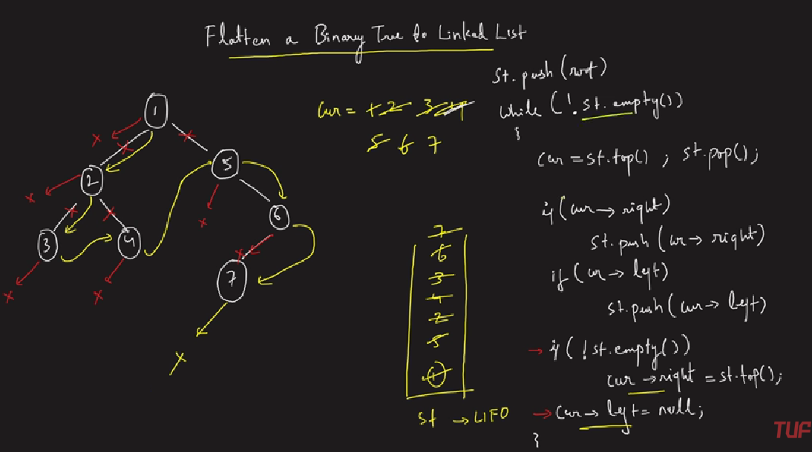

### Question
- Given the root of a binary tree, flatten the tree into a "linked list":
  - The "linked list" should use the same TreeNode class where the right child pointer points to the next node in the list and the left child pointer is always null. 
  - The "linked list" should be in the same order as a pre-order traversal of the binary tree.

### Sample Input
    root = [1,2,5,3,4,null,6]
    root = []

### Sample Output
    [1,null,2,null,3,null,4,null,5,null,6]
    []

### Solution
- Take a stack and push the root node to it. 
- Set a while loop till the stack is non-empty. 
- In every iteration, take the node at the top of the stack( say cur) and pop the stack. 
- If cur has a right child, push it to the stack. 
- If cur has a left child, push it to the stack. 
- Set the right child of cur to node at stack’s top. 
- Set the left child of cur as NULL.
  

### Code
    static TreeNode prev= null;
    public void flatten(TreeNode root) {
        Stack<TreeNode> st= new Stack<>();
        if (root==null) return;
        st.push(root);
        while (!st.isEmpty()){
            TreeNode cur= st.pop();
            if (cur.right!=null)  st.push(cur.right);
            if (cur.left!=null)   st.push(cur.left);

            if (!st.isEmpty()){
                cur.right=st.peek();
            }
            cur.left=null;
        }
    }

### Edge Cases
- NA

### Other Techniques
- Recursion O(n) & O(n)
- Morris Traversal O(n) & O(1)

### Complexity
1. Time Complexity - O(N)
2. Space Complexity - O(N)