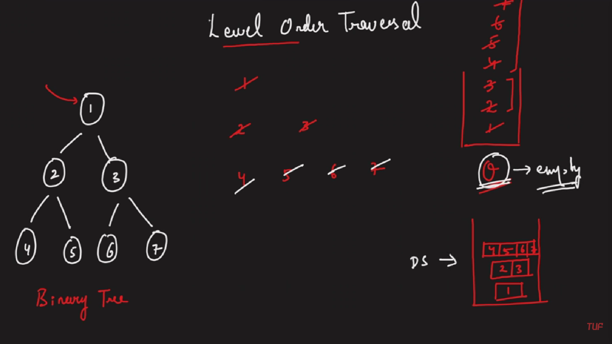

### Question
- Given the root of a binary tree, return the level order traversal of its nodes' values. (i.e., from left to right, level by level).

### Sample Input
    root = [3,9,20,null,null,15,7]
    root = [1]

### Sample Output
    [[3],[9,20],[15,7]]
    [[1]]

### Solution
- In Level Order or BFS traversal, we traverse level wise, print all elements of a level before going to the next level
- We will take a queue and a List of List to store answer
- initially we will add our root to the queue
- While the queue is not empty, we will find the queue size which tells about the length of the current level, and create a sublist
- Now we will traverse the current level, if there is a node to left & right, add them to queue one by one
- And then add the current node's value to the sublist and remove it from queue
- add the sublist to our result list

### Code
    public List<List<Integer>> levelOrder(TreeNode root){
        Queue<TreeNode> queue= new LinkedList<>();
        List<List<Integer>> res= new ArrayList<List<Integer>>();

        if (root==null) return res;
        queue.add(root);
        while (!queue.isEmpty()){
            int level= queue.size();
            List<Integer> subList = new ArrayList<>();
            for (int i = 0; i < level; i++) {
                if (queue.peek().left!=null){
                    queue.add(queue.peek().left);
                }
                if (queue.peek().right!=null){
                    queue.add(queue.peek().right);
                }
                subList.add(queue.poll().val);
            }
            res.add(subList);
        }
        return res;
    }

### Edge Cases
- NA

### Other Techniques
- NA

### Complexity
1. Time Complexity - O(N)
2. Space Complexity - O(N)