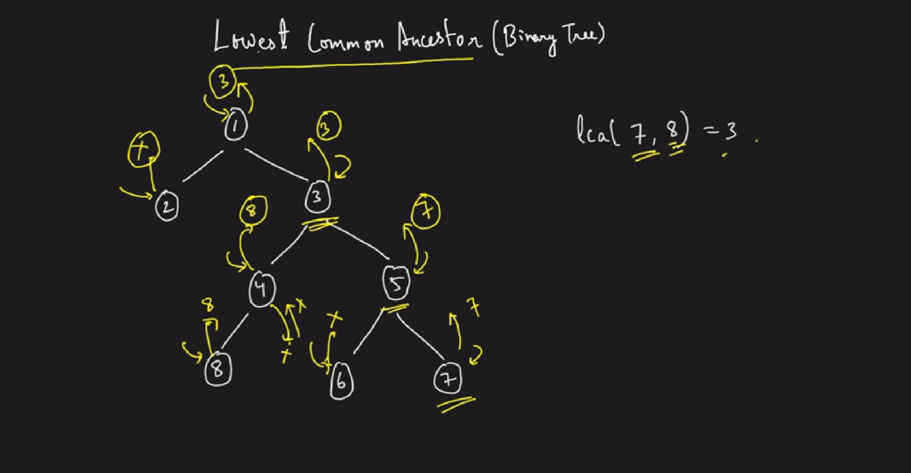

### Question
- Given a binary tree, find the lowest common ancestor (LCA) of two given nodes in the tree. 
- According to the definition of LCA on Wikipedia: “The lowest common ancestor is defined between two nodes p and q as the lowest node in T that has both p and q as descendants (where we allow a node to be a descendant of itself).”

### Sample Input
    root = [3,5,1,6,2,0,8,null,null,7,4], p = 5, q = 1
    root = [3,5,1,6,2,0,8,null,null,7,4], p = 5, q = 4

### Sample Output
    3
    5

### Solution
- We will recursively go to left & right from root
- Wherever we encounter the node to be null or p or q we will simply return the root.
- If left is giving us null, then we will return right
- If right is giving us null, then we will return left
- But if none of them is giving null, means we got our answer, return the node

For understanding: 
- In above example, when we go to left of 3 i.e., the Node 4, its left have 8 which is equal to q, so return 8. From right it gets null, so it'll ultimately return the left i.e., 8.
- Next we go to right of 3, i.e., Node 5, its left returns null & right will return 7 as it is equal to p. So, 5 from left gets null, so it'll ultimately return right i.e., 7.
- Now our node 3 ultimately gets values from both sides, left & right, which means this is the actual ancestor so from here we'll return the node's actual value itself i.e., 3
- Our root, from left gets null & from right gets 3, so It'll take right as left is null and will return 3

### Code
     public TreeNode lowestCommonAncestor(TreeNode root, TreeNode p, TreeNode q) {
        if (root==null || root==p || root==q) return root;

        TreeNode left = lowestCommonAncestor(root.left, p, q);
        TreeNode right = lowestCommonAncestor(root.right, p, q);

        if (left==null) return right;
        else if (right==null) return left;
        else return root;   //none of left & right is null, we found our result
    }

### Edge Cases
- NA

### Other Techniques
- We can find the path to both the given nodes from root & store each path in two arrays
- Then we can traverse in the arrays using two pointers & the last number which is same in both of them is answer

### Complexity
1. Time Complexity - O(N)
2. Space Complexity - O(N)