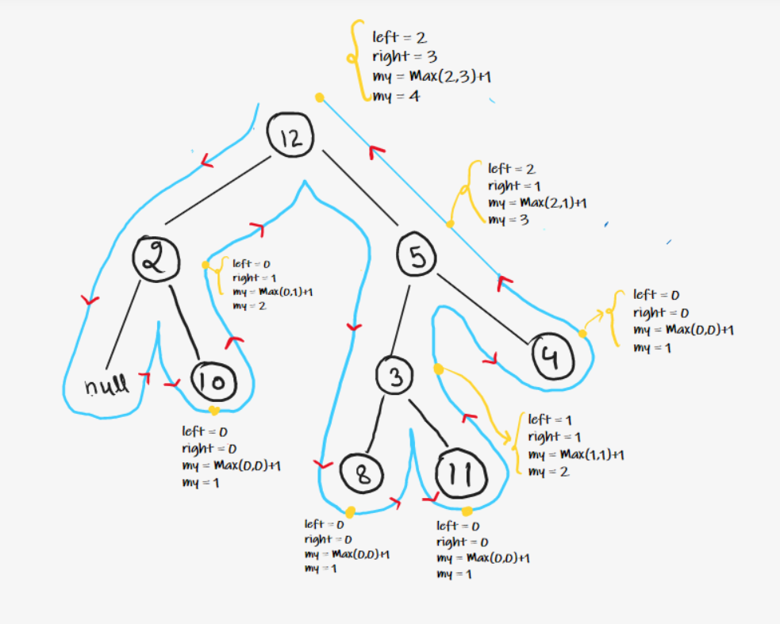

### Question
- Given the root of a binary tree, return its maximum depth. 
- A binary tree's maximum depth is the number of nodes along the longest path from the root node down to the farthest leaf node.

### Sample Input
    root = [3,9,20,null,null,15,7]
    root = [1,null,2]

### Sample Output
    3
    2

### Solution
- To calculate the Maximum Depth, we can simply take the maximum of the depths of the left and right subtree and add 1 to it. 
- Why take Maximum?? Because we need maximum depth so if we know left & right children’s maximum depth then we’ll definitely get to the maximum depth of the entire tree.
- We start to travel recursively and do our work in Post Order.
  Reason behind using Post Order comes from our intuition , that if we know the result of  left and right child then we can calculate the result using that.
- So for every node post order, we do Max( left result , right result ) + 1 and return it to the previous call. 
- Base Case is when root == null so we need to return 0;
  

### Code
    public static int maxDepth(TreeNode root){
        if (root==null) return 0;
        int lh= maxDepth(root.left);
        int rh=maxDepth(root.right);

        return 1+Math.max(lh,rh);
    }

### Edge Cases
- NA

### Other Techniques
- NA

### Complexity
1. Time Complexity - O(N)
2. Space Complexity - O(1) + O(H) stack space