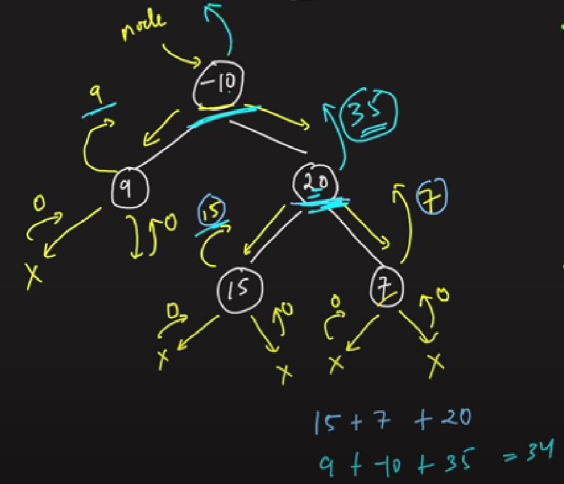

### Question
- A path in a binary tree is a sequence of nodes where each pair of adjacent nodes in the sequence has an edge connecting them. A node can only appear in the sequence at most once. Note that the path does not need to pass through the root. 
- The path sum of a path is the sum of the node's values in the path. 
- Given the root of a binary tree, return the maximum path sum of any non-empty path.

### Sample Input
    root = [1,2,3]
    root = [-10,9,20,null,null,15,7]

### Sample Output
    6
    42

### Solution 
- Just like depth of Binary tree problem, for each node we can find its max left path & its max right path and add it with its value to get the maxPathSum for the particular node
- First of all, we will recursively check at both left & right side for the maximumPath, but there's a slight problem. If on any side, there is a result which is coming as negative, we can totally avoid it by just returning 0 instead of negative result
- That's why, on both left & right, we find the max(0, maxPath(root.left or root.right, maxVal)), if there's a negative result, we return 0, else we return the maxPath returned
- Then we will update our answer, stored in maxVal[0] to the maxValue we got till now, by adding left result + right result + current Node's value
- At the end, just like depth of BT, we return max(left, right) + current Node's value, since we need to get the values, not the height, we are taking values of the nodes
- Note: We are taking max(left, right) as to the ancestor node, we must return the 1 maxPath, it can be either from the left or the right, not their sum

### Code
    public static int maxPathSum(TreeNode root){
        int[] maxVal= new int[1];
        maxVal[0]= Integer.MIN_VALUE;
        maxPath(root, maxVal);
        return maxVal[0];
    }

    private static int maxPath(TreeNode root, int[] maxVal) {
        if (root==null) return 0;
        int left = Math.max(0, maxPath(root.left, maxVal));
        int right = Math.max(0, maxPath(root.right, maxVal));

        maxVal[0]= Math.max(maxVal[0], left+right+root.val);
        return Math.max(left, right)+root.val;
    }

### Edge Cases
- NA

### Other Techniques
- NA

### Complexity
1. Time Complexity - O(N)
2. Space Complexity - O(1) + O(H) stack space