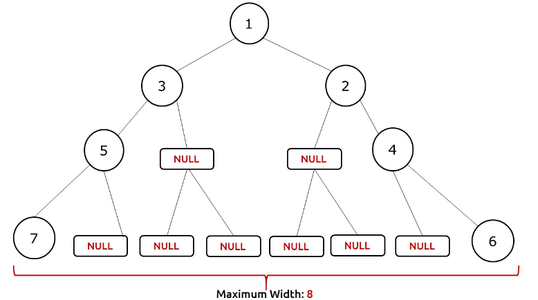
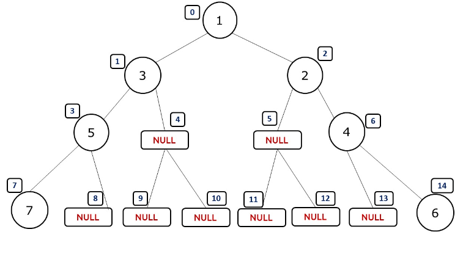
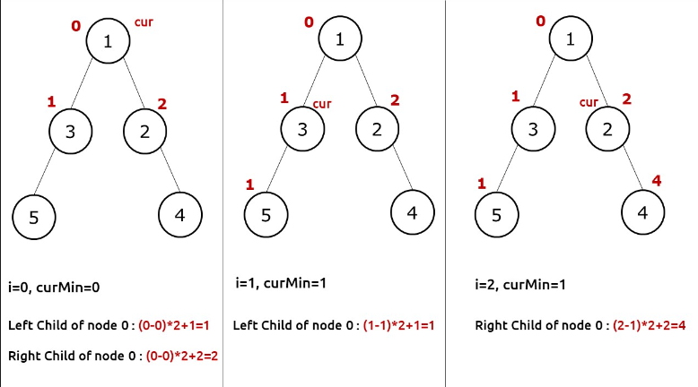

### Question
- Given the root of a binary tree, return the maximum width of the given tree. 
- The maximum width of a tree is the maximum width among all levels. 
- The width of one level is defined as the length between the end-nodes (the leftmost and rightmost non-null nodes), where the null nodes between the end-nodes that would be present in a complete binary tree extending down to that level are also counted into the length calculation. 
- It is guaranteed that the answer will in the range of a 32-bit signed integer.

### Sample Input
    root = [1,3,2,5,3,null,9]
    root = [1,3,2,5,null,null,9,6,null,7]

### Sample Output
    4
    7

### Solution

- We see that the width is defined by the nodes of one particular level. Therefore we can use a level order traversal to traverse the tree and in every level, we try to find the leftmost and rightmost node of that level. To achieve this we would need a proper indexing strategy to uniquely index nodes of a level. Once we know the leftMost and rightMost nodes, width can be defined as (rightMost- leftMost +1).

- If we index the tree as shown above we can easily calculate the width of the tree as rightMostNode – leftMostNode +1. Then we can return the maximum width as our answer. To store the index, we can use a pair of values in our queue( that we use for level order traversal). If we are at index i, then its left and right child are(in 0-based indexing): 2*i+1 and 2*i+2 respectively. Please note that NULL nodes are not hampering the indexing in any way.
- This approach has a problem, as we are multiplying 2 to the current index, it can happen in a tree that we overshoot the bound of an integer. Therefore, we need to find a strategy to prevent it. Before starting a level, we can store the left-most index in a variable( say mini). Now whenever we assign the index for its children, we take the parent node index as (i-mini) rather than i.

- As our final answer is a range of nodes in a level, i,e rightMost- leftMost+1; this strategy will not affect the answer and at the same time prevent the integer overflow case.

### Algorithm
- We take a queue and push the root node along with index 0. 
- We traverse the tree using a level order traversal. 
- In the level order traversal we set another loop to run for the size of the queue, so that we visit the same level nodes inside it. 
- Before a level starts, we use a variable(say mini) to store the index of the first node. 
- We assign an index to every node, and to its children as described above. 
- When the inner loop is at the first node of a level, we store its index in another variable(say leftMost)
- When the inner loop is at the last node of a level, we store its index in another variable(say rightMost)
- After a level  in the outer loop, we calculate the width of the level as (rightMost – leftMost +1). 
- We return the maximum width as the answer.

### Code
    static class Pair{
        TreeNode node;
        int num;
        Pair(TreeNode node, int num){
            this.node= node;
            this.num= num;
        }
    }

    public static int widthOfBinaryTree(TreeNode root){
        if (root==null) return 0;
        Queue<Pair> q= new LinkedList<>();
        int ans=0;
        q.add(new Pair(root, 0));
        while (!q.isEmpty()){
            int size= q.size();
            int mini= q.peek().num;
            int first=0, last=0;
            for (int i = 0; i < size; i++) {
                int cur = q.peek().num - mini;
                TreeNode node= q.poll().node;
                if (i==0) first= cur;
                if (i== size-1) last = cur;
                if (node.left!=null){
                    q.add(new Pair(node.left, cur*2+1));
                }
                if (node.right!=null){
                    q.add(new Pair(node.right, cur*2+2));
                }
            }
            ans= Math.max(ans, last-first+1);
        }
        return ans;
    }

### Edge Cases
- NA

### Other Techniques
- NA

### Complexity
1. Time Complexity - O(N)
2. Space Complexity - O(N)