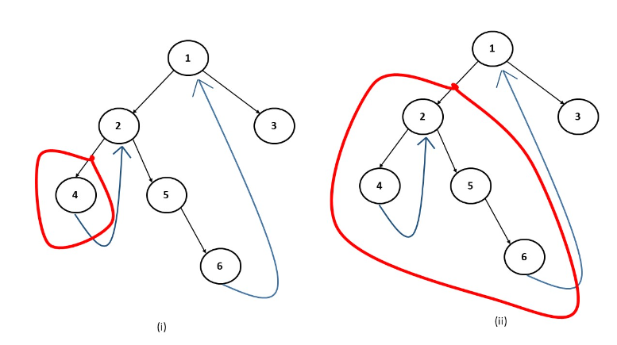

### Question
- Write a program for Morris Inorder Traversal of a Binary Tree.

### Sample Input
    root = [1,null,2,3]
    root = []

### Sample Output
    [1,3,2]
    []

### Solution

- In inorder we do: Left, root, right. If we mark traversals, we will get a threaded binary tree like above. We need to figure out how we can go back in the tree from a child to a parent without using recursion. We break this tree into small sub-trees (marked in red)
- In figure (i), we see that when we are at node 4 and this red subtree has no right child, we move to the parent of this subtree, i.e node 2. Similarly, in figure(ii), when we are at node 6, this red subtree has no right child, therefore we move to its parent, i.e node 1
- When we are currently at a node, the following cases can arise:
  - Case 1: When the current node has no left subtree. In this scenario, there is nothing to be traversed on the left side, so we simply print the value of the current node and move to the right of the current node. 
  - Case 2: When there is a left subtree and the right-most child of this left subtree is pointing to null. In this case we need to set the right-most child to point to the current node, instead of NULL and move to the left of the current node. 
  - Case 3: When there is a left subtree and the right-most child of this left-subtree is already pointing to the current node. In this case we know that the left subtree is already visited so we need to print the value of the current node and move to the right of the current node.
- To summarize, at a node whether we have to move left or right is determined whether the node has a left subtree. If it doesn’t we move to the right. If there is a left subtree then we see its rightmost child. If the rightmost child is pointing to NULL, we move the current node to its left. If the rightmost child is already pointing towards the current node, we remove that link and move to the right of the current node. We will stop the execution when the current points to null and we have traversed the whole tree.

### Code
     public static List<Integer> inorderTraversal(TreeNode root){
        List<Integer> inorder= new ArrayList<>();
        TreeNode cur= root;
        while (cur!=null){
            if (cur.left==null){
                inorder.add(cur.val);
                cur= cur.right;
            }else{
                TreeNode prev=cur.left;
                while (prev.right!=null && prev.right!=cur){
                    prev=prev.right;
                }

                if (prev.right==null){
                    prev.right=cur;
                    cur=cur.left;
                }else{
                    prev.right=null;
                    inorder.add(cur.val);
                    cur=cur.right;
                }
            }
        }
        return inorder;
    }

### Edge Cases
- NA

### Other Techniques
- NA

### Complexity
1. Time Complexity - O(N)
2. Space Complexity - O(1)