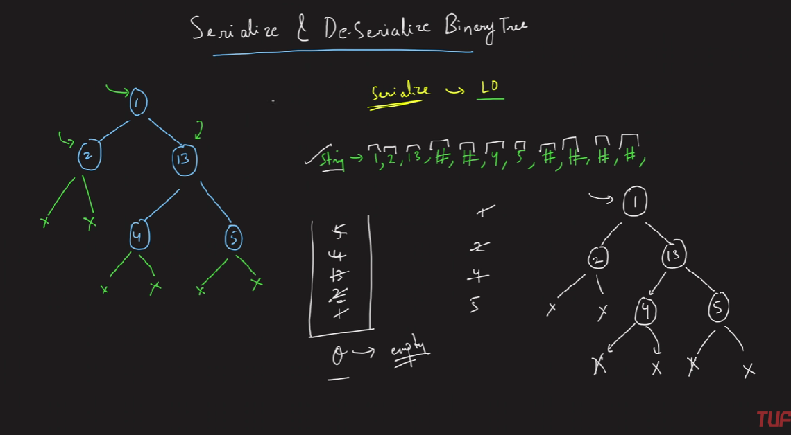

### Question
- Serialization is the process of converting a data structure or object into a sequence of bits so that it can be stored in a file or memory buffer, or transmitted across a network connection link to be reconstructed later in the same or another computer environment. 
- Design an algorithm to serialize and deserialize a binary tree. There is no restriction on how your serialization/deserialization algorithm should work. You just need to ensure that a binary tree can be serialized to a string and this string can be deserialized to the original tree structure.
- Clarification: The input/output format is the same as how LeetCode serializes a binary tree. You do not necessarily need to follow this format, so please be creative and come up with different approaches yourself.

### Sample Input
    root = [1,2,3,null,null,4,5]
    root = []

### Sample Output
    [1,2,3,null,null,4,5]
    []

### Solution
- Serialize()
  - We will do level order traversal, at each level we will pop from queue, if node is empty we will add # in our string, else just add node.val along with space
  - add node's left & right to queue even if it's null
  - return the string
- Deserialize()
  - We will split the string and convert it into an array of strings
  - We will again use a Queue, add the root in it
  - Traverse in the string array from second index, create parent node, by popping from queue
  - If the element is not #, then create a new Node and add to left, and the next element will similarly be in right
  - Move parent pointer & add the node's values in queue

### Code
    public String serialize(TreeNode root) {
        if (root==null) return "";
        Queue<TreeNode> q = new LinkedList<>();
        StringBuilder res= new StringBuilder();
        q.offer(root);
        while (!q.isEmpty()){
            TreeNode node = q.poll();
            if (node==null){
                res.append("# ");
                continue;
            }
            res.append(node.val).append(" ");
            q.add(node.left);
            q.add(node.right);
        }
        return res.toString();
    }

    // Decodes your encoded data to tree.
    public TreeNode deserialize(String data) {
        if (data.equals("")) return null;
        Queue<TreeNode> q = new LinkedList<>();
        String[] values= data.split(" ");
        TreeNode root = new TreeNode(Integer.parseInt(values[0]));
        q.offer(root);
        for(int i=1; i< values.length; i++){
            TreeNode parent= q.poll();
            if (!values[i].equals("#")){
                TreeNode left= new TreeNode(Integer.parseInt(values[i]));
                parent.left=left;
                q.add(left);
            }
            if(!values[++i].equals("#")){
                TreeNode right = new TreeNode(Integer.parseInt(values[i]));
                parent.right=right;
                q.add(right);
            }
        }
        return root;
    }

### Other Techniques
- NA

### Complexity
1. Time Complexity - O(N)
2. Space Complexity - O(N)