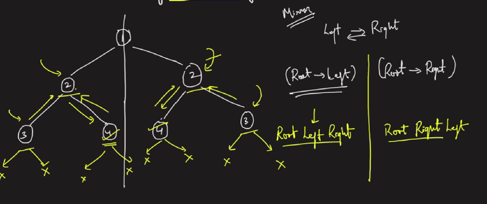

### Question
- Given the root of a binary tree, check whether it is a mirror of itself (i.e., symmetric around its center).

### Sample Input
    root = [1,2,2,3,4,4,3]
    root = [1,2,2,null,3,null,3]

### Sample Output
    true
    false

### Solution
- To check if the left side is symmetric to right, we will just check if current node's left on left side is equal to current node's right on right side

### Code
    public static boolean isSymmetric(TreeNode root){
        return root==null || isSymmetricalHelp(root.left, root.right);
    }

    private static boolean isSymmetricalHelp(TreeNode left, TreeNode right) {
        if (left==null || right==null) return left==right;
        if (left.val!=right.val) return false;
        return isSymmetricalHelp(left.left, right.right) && isSymmetricalHelp(left.right, right.left);
    }

### Edge Cases
- NA

### Other Techniques
- NA

### Complexity
1. Time Complexity - O(N)
2. Space Complexity - O(N)