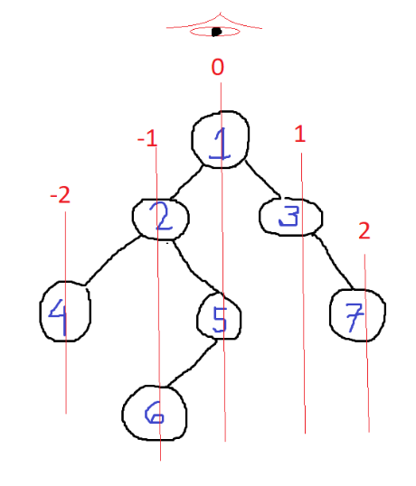

### Question
- You have been given a binary tree of integers. Your task is to return the top view of the given binary tree. The top view of the binary tree is the set of nodes that are visible when we see the tree from the top.

### Sample Input
    1 2 3 4 5 6 7 8 9 -1 -1 -1 -1 -1 -1 -1 -1 -1 -1
    1 2 3 -1 -1 -1 -1

### Sample Output
    8 4 2 1 3 7
    2 1 3

### Solution

- We can mark straight lines like in the image below and mark them with +ve and -ve indexes. The first node of every line will be top view.
- We will have a Queue of Pair in which we will store the nodes & their respecting -ve or +ve indexes
- And we will take a map ds (line index, node's val) for having a unique node for each line & we will make use of TreeMap to keep the map in sorted order
- We will do level order traversal & initially store the root to queue, & traverse the queue till it's empty
- We will pop from queue, which is a pair. We will check if the map doesn't have the current line index, then we will add the current line index & value of the node to map
- Now we will check to left of current node, if it's present we add a new Pair of left node & line index - 1 to queue
- Similarly we will check to right of current node, if it's present we add a new Pair of right node & line index+1 to queue
- Once queue is empty, the sorted top view will be present in our map, just add the values of each key of map to our answer list & return the list

### Code
    static class Pair{
        int hd;
        BinaryTreeNode node;
        Pair(BinaryTreeNode node, int hd){
            this.hd=hd;
            this.node= node;
        }
    }

    public static ArrayList<Integer> getTopView(BinaryTreeNode root) {
        ArrayList<Integer> ans= new ArrayList<>();
        if (root==null) return ans;
        Map<Integer, Integer> map= new TreeMap<>();
        Queue<Pair> q= new LinkedList<>();
        q.add(new Pair(root, 0));
        while (!q.isEmpty()){
            Pair it = q.poll();
            int hd= it.hd;
            BinaryTreeNode temp= it.node;
            if (!map.containsKey(hd)) map.put(hd, temp.val);
            if (temp.left!=null){
                q.add(new Pair(temp.left, hd-1));
            }
            if (temp.right!=null){
                q.add(new Pair(temp.right, hd+1));
            }
        }

        for (Map.Entry<Integer,Integer> entry: map.entrySet()){
            ans.add(entry.getValue());
        }
        return ans;
    }

### Edge Cases
- NA

### Other Techniques
- NA

### Complexity
1. Time Complexity - O(N)
2. Space Complexity - O(N)