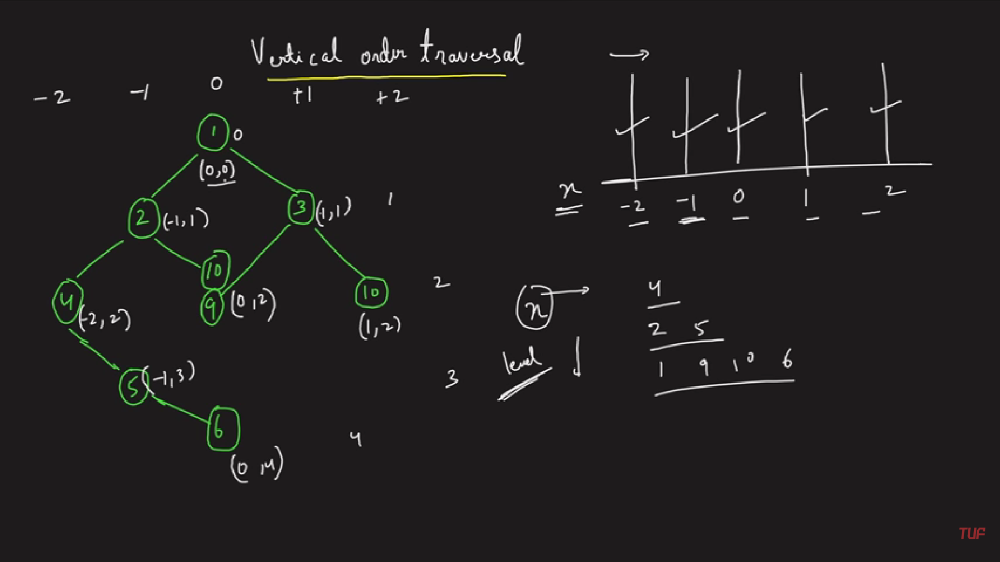

### Question
- Given the root of a binary tree, calculate the vertical order traversal of the binary tree. 
- For each node at position (row, col), its left and right children will be at positions (row + 1, col - 1) and (row + 1, col + 1) respectively. The root of the tree is at (0, 0). 
- The vertical order traversal of a binary tree is a list of top-to-bottom orderings for each column index starting from the leftmost column and ending on the rightmost column. There may be multiple nodes in the same row and same column. In such a case, sort these nodes by their values. 
- Return the vertical order traversal of the binary tree.

### Sample Input
    root = [3,9,20,null,null,15,7]
    root = [1,2,3,4,5,6,7]

### Sample Output
    [[9],[3,15],[20],[7]]
    [[4],[2],[1,5,6],[3],[7]]

### Solution

- The important thing here is choosing the right data structure, we want to store three things for each node, (Position on X axis, Level at which it is present, Node's value)
- We used a TreeMap whose key is the position on x-axis, as we need the answer in vertical order from the leftmost vertical line, so this way in the above example, -2 line's value will be at first
- The value of the TreeMap will have another TreeMap, whose key will be the level at which node is present, this is to ensure that if at a certain level & position, two nodes are present (like at 0,2), the node which has small value is returned first
- The value of the inner Treemap was a Priority Queue which automatically stores the minimum node's value first
- We can do the traversal with any method which we want, I used Preorder Traversal and started with the root
- If we don't have any value for the current pos, we will insert the current Pos & a new Treemap in our main TreeMap.
- Then we will put the level & new PQ in the current Pos if it's not present already
- Then we will add the node's val in the currentPos & level of the map
- Once done, we will recursively move to left(pos-1) & right nodes(pos+1)
- This way our map will be filled, now to store in our ans list
- We will traverse in each value of the Outer TreeMap, create a temp list, and we will traverse in the values of the inner treemap
- While our Priority Queue is not empty, we will add the node in temp & delete from Pq
- Then we will add temp to our ans list & return it

### Code
    public static List<List<Integer>> verticalTraversal(TreeNode root){
        TreeMap<Integer, TreeMap<Integer, PriorityQueue<Integer>>> map = new TreeMap<>();
        preorderTraversal(root, 0, 0, map);
        List<List<Integer>> ans= new ArrayList<>();
        for (TreeMap<Integer, PriorityQueue<Integer>> inMap: map.values()){
            ArrayList<Integer> temp= new ArrayList<>();
            for (PriorityQueue<Integer> pq: inMap.values()){
                while (!pq.isEmpty()){
                    temp.add(pq.poll());
                }
            }
            ans.add(temp);
        }
        return ans;
    }

    private static void preorderTraversal(TreeNode root, int level, int posIndex,TreeMap<Integer, TreeMap<Integer, PriorityQueue<Integer>>> map) {
        if (root==null) return;
        map.putIfAbsent(posIndex, new TreeMap<>());
        map.get(posIndex).putIfAbsent(level, new PriorityQueue<Integer>());
        map.get(posIndex).get(level).add(root.val);

        preorderTraversal(root.left, level+1, posIndex-1, map);
        preorderTraversal(root.right, level+1, posIndex+1, map);
    }

### Edge Cases
- NA

### Other Techniques
- NA

### Complexity
1. Time Complexity - O(NlogN * logN * logN)
2. Space Complexity - O(N)