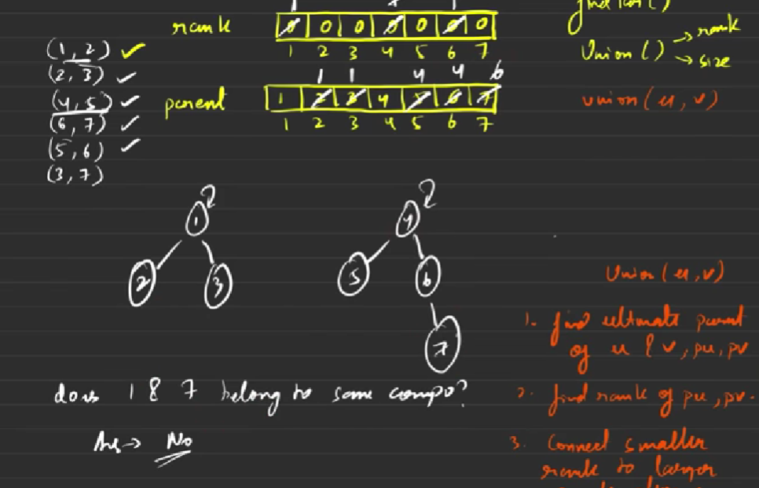
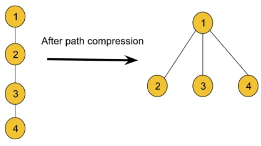
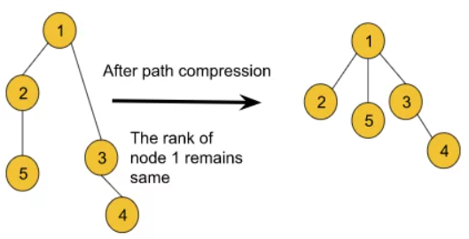
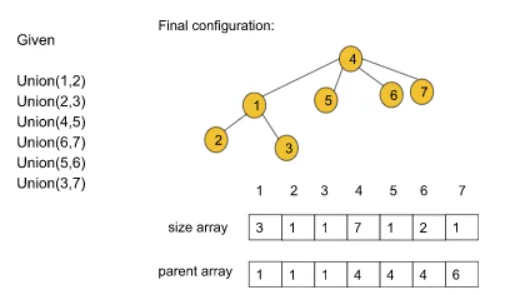

## Dynamic Graph
- The disjoint Set data structure is generally used for dynamic graphs.
- A dynamic graph generally refers to a graph that keeps on changing its configuration, i.e., we can keep on adding new edges between nodes, while also in between we can check if two nodes belong to same component or not
- after any step, if we try to figure out whether two arbitrary nodes u and v belong to the same component or not, Disjoint Set will be able to answer this query in constant time.

## Operations of Disjoint Set
The disjoint set data structure generally provides two types of functionalities:
- Finding the parent for a particular node (findPar())
- Union (in broad terms this method basically adds an edge between two nodes)
  - Union by rank
  - Union by size

## Union by Rank
**Rank:**
The rank of a node generally refers to the distance (the number of nodes including the leaf node) between the furthest leaf node and the current node. Basically rank includes all the nodes beneath the current node.

**Ultimate Parent:**
The parent of a node generally refers to the node right above that particular node. But the ultimate parent refers to the topmost node or the root node.

**Algorithm:** 
- rank array: This array is initialized with zero.
- parent array: The array is initialized with the value of nodes i.e. parent[i] = i.
- The algorithm steps are as follows:
  - Firstly, the Union function requires two nodes(let’s say u and v) as arguments. Then we will find the ultimate parent (using the findPar() function that is discussed later) of u and v. Let’s consider the ultimate parent of u is pu and the ultimate parent of v is pv.
  - After that, we will find the rank of pu and pv.
  - Finally, we will connect the ultimate parent with a smaller rank to the other ultimate parent with a larger rank. But if the ranks are equal, we can connect any parent to the other parent and we will increase the rank by one for the parent node to whom we have connected the other one.

### Observations

- If we carefully observe, we are only concerned about the ultimate parent but not the immediate parent. 
- After union by rank operations, if we are asked (refer to the above picture) if node 5 and node 7 belong to the same component or not, the answer must be yes. If we carefully look at their immediate parents, they are not the same but if we consider their ultimate parents they are the same i.e. node 4. So, we can determine the answer by considering the ultimate parent. That is why we need to find the ultimate parent.
- So, here comes the findPar() function which will help us to find the ultimate parent for a particular node.
- **findPair()** function actually takes a single node as an argument and finds the ultimate parent for each node.

### Path Compression
- Now, if we try to find the ultimate parent(typically using recursion) of each query separately, it will end up taking O(logN) time complexity for each case. But we want the operation to be done in a constant time. This is where the path compression technique comes in. 
- Basically, connecting each node in a particular path to its ultimate parent refers to path compression. Using the path compression technique we can reduce the time complexity nearly to constant time.

- Before path compression, if we had tried to find the ultimate parent for node 4, we had to traverse all the way back to node 1 which is basically the height of size logN. But after path compression, we can easily access the ultimate parent with a single step. Thus the traversal reduces and as a result the time complexity also reduces. 
- Though using the path compression technique it seems like the rank of the node is also changing, we cannot be sure about it. So, we will not make any changes to the rank array while applying path compression. 

## Union By Size
- Until now, we have learned union by rank, the findPar() function, and the path compression technique. Now, if we again carefully observe, after applying path compression the rank of the graphs becomes distorted. So, rather than storing the rank, we can just store the size of the components for comparing which component is greater or smaller.
- This is as same as the Union by rank method except this method uses the size to compare the components while connecting. That is why we need a ‘size’ array of size N(no. of nodes) instead of a rank array. The size array will be storing the size for each particular node i.e. size[i] will be the size of the component starting from node i.

**Algorithm:** 
- size array: This array is initialized with one.
- parent array: The array is initialized with the value of nodes i.e. parent[i] = i.
- The algorithm steps are as follows:
  - Firstly, the Union function requires two nodes(let’s say u and v) as arguments. Then we will find the ultimate parent (using the findPar() function discussed earlier) of u and v. Let’s consider the ultimate parent of u is pu and the ultimate parent of v is pv.
  - After that, we will find the size of pu and pv i.e. size[pu] and size[pv].
  - Finally, we will connect the ultimate parent with a smaller size to the other ultimate parent with a larger size. But if the size of the two is equal, we can connect any parent to the other parent.
  - While connecting in both cases we will increase the size of the parent node to whom we have connected by the size of the other parent node which is actually connected.

## Time Complexity
The time complexity of both findParent() & Union() method is O(4α), where α is close to 1. So we can say the time complexity is almost constant
