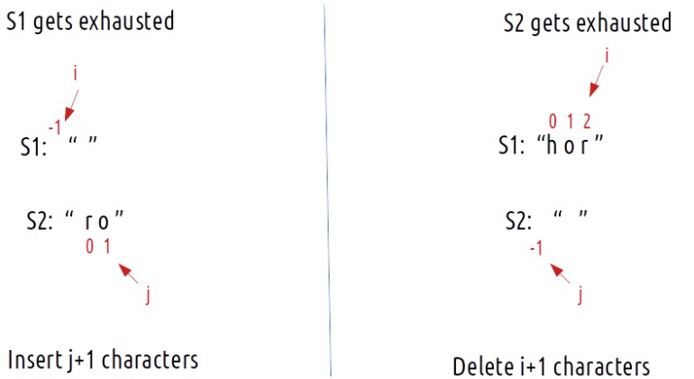

### Question
- Given two strings word1 and word2, return the minimum number of operations required to convert word1 to word2. 
- You have the following three operations permitted on a word:
  - Insert a character 
  - Delete a character 
  - Replace a character

### Sample Input
    word1 = "horse", word2 = "ros"
    word1 = "intention", word2 = "execution"

### Sample Output
    3
    5

### Solution
**Memoization:**
- We will initialize our DP[n][m] and fill it with -1
- We will try a two pointer approach, each pointer pointing to last character of the strings
- we will check if our dp has answer already for our current indexes, and return answer respectively
- if both the character in the strings are same, then we would not want to do any operations to make them match and we add 1 to our answer & decrement indexes of both array
- else, when the characters don't match:
  - insert: when we insert a character at word1, it'll eventually lead to match of word1 & word2 character, so we would decrement indexes. But instead of adding new character to string, we can simply decrement word2 pointer. (f(i,j-1))
  - Delete: To delete from word1, we can simply decrement its index, (f(i-1,j))
  - Replace: If we replace the character ‘e’ at index 4 of S1 with ‘s’, we have matched both the characters ourselves. We again hit the case of character matching, therefore we decrement both i and j by 1. (f(i-1,j-1))
- We will find the minimum of these 3 conditions & add 1 to our answer with them
- Base cases: We are reducing i and j in our recursive relation, there can be two possibilities, either i becomes -1 or j becomes -1., i,e we exhaust either S1 or S2 respectively. Suppose if S1 exhausts, we need to insert j+1 char in it, or if S2 exhausts, we need to delete i+1 char from it

**Tabultation:**
- In the recursive logic, we set the base case too if(i<0 ) and if(j<0) but we can’t set the dp array’s index to -1. Therefore a hack for this issue is to shift every index by 1 towards the right. So, First we initialise the dp array of size [n+1][m+1] as zero.
- Next, we set the base condition (keep in mind 1-based indexing), we set the first column’s value as i and the first row as j( 1-based indexing).
- Similarly, we will implement the recursive code by keeping in mind the shifting of indexes, therefore S1[i] will be converted to S1[i-1]. Same for S2.

### Code
    //Memoization
    public static int minDistance(String word1, String word2){
        int n=word1.length(), m=word2.length();
        int[][] dp= new int[n][m];
        for (int[] row: dp) Arrays.fill(row, -1);
        return getMinDistance(word1, word2, n-1, m-1, dp);
    }

    private static int getMinDistance(String word1, String word2, int i, int j, int[][] dp) {
        if (i<0) return j+1;
        if (j<0) return i+1;
        if (dp[i][j]!=-1) return dp[i][j];

        if (word1.charAt(i)==word2.charAt(j)){
            return dp[i][j]= 0 + getMinDistance(word1, word2, i-1, j-1, dp);
        }
        else{
            int minInsertionDeletion = Math.min(getMinDistance(word1, word2, i-1, j, dp), getMinDistance(word1, word2, i, j-1, dp));
            return dp[i][j]= 1+ Math.min(getMinDistance(word1, word2, i-1, j-1, dp), minInsertionDeletion);
        }
    }

    //Tabulation
    public static int minDistanceTabulation(String word1, String word2){
        int n=word1.length(), m=word2.length();
        int[][] dp= new int[n+1][m+1];
        for (int i = 0; i <= n; i++) {
            dp[i][0]= i;
        }
        for (int i = 0; i <= m; i++) {
            dp[0][i]=i;
        }

        for (int i = 1; i <= n; i++) {
            for (int j = 1; j <= m; j++) {
                if (word1.charAt(i-1)==word2.charAt(j-1)){
                    dp[i][j]= 0 + dp[i-1][j-1];
                }else{
                    dp[i][j] = 1 + Math.min(dp[i-1][j-1], Math.min(dp[i][j-1], dp[i-1][j]));
                }
            }
        }
        return dp[n][m];
    }

### Other Techniques
- NA

### Complexity
1. Time Complexity - O(N*M)
2. Space Complexity - O(N*M)