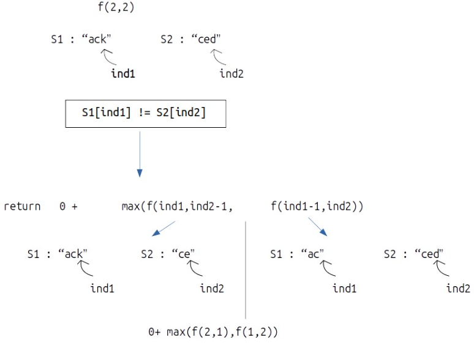

### Question
- Given two strings text1 and text2, return the length of their longest common subsequence. If there is no common subsequence, return 0. 
- A subsequence of a string is a new string generated from the original string with some characters (can be none) deleted without changing the relative order of the remaining characters. 
- For example, "ace" is a subsequence of "abcde". 
- A common subsequence of two strings is a subsequence that is common to both strings.

### Sample Input
    text1 = "abcde", text2 = "ace" 
    text1 = "abc", text2 = "def"

### Sample Output
    3
    0

### Solution
**Memoization:**
- We will initialize our DP[n][m] and fill it with -1
- We will try a two pointer approach, each pointer pointing to last character of the strings
- we will check if our dp has answer already for our current indexes, and return answer respectively

- if both the character in strings are same, then we add 1 to our answer & decrement indexes of both array
- else, we would add the max answer we get from decrementing only index 1 or only index 2

**Tabultation:**
- In the recursive logic, we set the base case to if(ind1<0 || ind2<0) but we can’t set the dp array’s index to -1. Therefore a hack for this issue is to shift every index by 1 towards the right. So our dp will be of dp[n+1][m+1], it will be automatically initialised as 0
- Now traverse from 1st row & 1st column, & if both characters are same, store 1 + dp[ind1-1][ind2-1] in dp[ind1][ind2]
- else store max of answer we get from decrementing either index1 or index2

### Code
    //Memoization
    static int lcs(String s1, String s2) {
        int n=s1.length(), m=s2.length();
        int[][] dp=new int[n][m];
        for(int[] rows: dp) Arrays.fill(rows,-1);
        return lcsUtil(s1,s2,n-1,m-1,dp);
    }

    static int lcsUtil(String s1, String s2, int ind1, int ind2, int[][] dp){
        if(ind1<0 || ind2<0) return 0;
        if(dp[ind1][ind2]!=-1) return dp[ind1][ind2];

        if(s1.charAt(ind1) == s2.charAt(ind2))
            return dp[ind1][ind2] = 1 + lcsUtil(s1,s2,ind1-1,ind2-1,dp);
        else
            return dp[ind1][ind2] = 0 + Math.max(lcsUtil(s1,s2,ind1,ind2-1,dp), lcsUtil(s1,s2,ind1-1,ind2,dp));
    }

    //Tabulation
    public static int longestCommonSubsequence(String text1, String text2){
        int n=text1.length(), m=text2.length();
        int[][] dp = new int[n+1][m+1];

        for (int ind1=1; ind1<=n; ind1++){
            for (int ind2 = 1; ind2 <= m; ind2++) {
                if (text1.charAt(ind1-1)==text2.charAt(ind2-1)){
                    dp[ind1][ind2]= 1+dp[ind1-1][ind2-1];
                }else{
                    dp[ind1][ind2]= Math.max(dp[ind1][ind2-1], dp[ind1-1][ind2]);
                }
            }
        }
        return dp[n][m];
    }

### Other Techniques
- Generate all subsequence - brute force

### Complexity
1. Time Complexity - O(N*M)
2. Space Complexity - O(N*M)