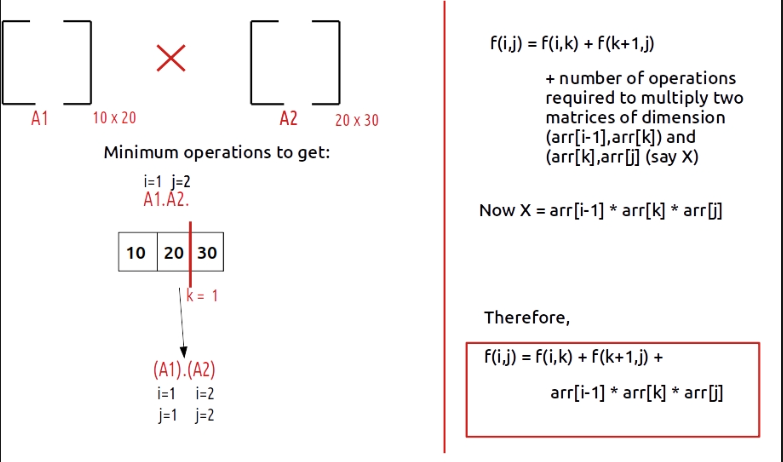

### Question
- Given a sequence of matrices, find the most efficient way to multiply these matrices together. The efficient way is the one that involves the least number of multiplications. 
- The dimensions of the matrices are given in an array arr[] of size N (such that N = number of matrices + 1) where the ith matrix has the dimensions (arr[i-1] x arr[i]).

### Sample Input
    N = 5, arr = {40, 20, 30, 10, 30}
    N = 4, arr = {10, 30, 5, 60}

### Sample Output
    26000
    4500

### Matrix Chain Multiplication
- Two matrices A1 and A2 of dimensions [p x q] and [r x s] can only be multiplied if and only if q=r
- The total number of multiplications required to multiply A1 and A2 are: p*q*s

- Given a chain of matrices A1,…, An denoted by an array of size n+1, find out the minimum number of operations to multiply these n matrices.

- As this problem of matrix multiplication solves one big problem ( minimum operations to get A1.A2….An) and the answer varies in the order the subproblems are being solved, we can identify this problem of pattern partition DP.

### Solution
- First we will check the minimum operations to get the product of matrices & check all the partitions that can be made using indexing

- As we can see 3 partitions are possible, to try all three partitions, we can write a for loop starting from i and ending at j-1, (1 to 3). The two partitions will be f(i,k) and f(k+1,j).
- Base case: If i==j, it means we are interested in a single matrix and no operation is required to multiply it so we return 0.
- As there are only two matrices, we can say that only one partition is possible at k=1, when we do this partition, we see that the two partitions made are f(1,1) and f(2,2) (by f(i,k) and f(k+1,j) therefore we hit the base condition in both of these subcases which return 0. 
- Now, we know that the subproblems/partitions give us 0 operations, but we still have some work to do. The partition f(i,k) gives us a resultant matrix of dimensions [i -1 x k] and the partition f(k+1,j) gives us a resultant matrix of dimensions [k,j]. Therefore we need to count the number of operations for our two partitions (k=1) as shown

- Now, this is at one partition, in general, we need to calculate this answer of every partition and return the minimum as the answer.

**Algo:**
- Represent the entire array by two indexes i and j. In this question i =1 and j = n. We need to find f(i,j). 
- Maintain a mini variable to get the minimum answer. 
- Set a for loop to find the answer( variable k) from i to j-1, 
- In every iteration find the answer, with the formula discussed above and compare it with the mini value. Return mini as the answer.

### Code
    static int matrixMultiplication(int N, int[] arr) {
        int[][] dp= new int[N][N];
        for (int[] row: dp) Arrays.fill(row, -1);

        return getMCM(arr, 1, N-1, dp);
    }

    private static int getMCM(int[] arr, int i, int j, int[][] dp) {
        if (i==j) return 0;
        if (dp[i][j] != -1) return dp[i][j];
        int mini = Integer.MAX_VALUE;

        for (int k =i; k<=j-1; k++){
            int ans = getMCM(arr, i, k, dp) + getMCM(arr, k+1, j, dp) + arr[i-1] * arr[k] * arr[j];
            mini = Math.min(mini, ans);
        }
        dp[i][j]= mini;
        return mini;
    }

### Complexity
1. Time Complexity - O(N^3)
2. Space Complexity - O(N^2)