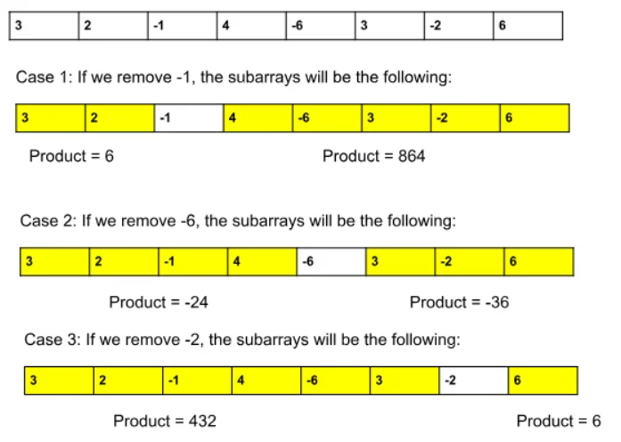

### Question
- Given an integer array nums, find a subarray that has the largest product, and return the product. 
- The test cases are generated so that the answer will fit in a 32-bit integer.

### Sample Input
    nums = [2,3,-2,4]
    nums = [-2,0,-1]

### Sample Output
    6
    0

### Intuition
- If the given array only contains positive numbers: If this is the case, we can confidently say that the maximum product subarray will be the entire array itself.
- If the given also array contains an even number of negative numbers: As we know, an even number of negative numbers always results in a positive number. So, also, in this case, the answer will be the entire array itself.
- If the given array also contains an odd number of negative numbers: Now, an odd number of negative numbers when multiplied result in a negative number. Removal of 1 negative number out of the odd number of negative numbers will leave us with an even number of negatives.

### Solution
- Upon observation, we notice that each chosen negative number divides the array into two parts. 
- The answer will either be the prefix or the suffix of that negative number. 
- To find the answer, we will check all possible prefix subarrays (starting from index 0) and all possible suffix subarrays (starting from index n-1). 
- The maximum product obtained from these prefix and suffix subarrays will be our final answer. 
- If the array contains 0’s as well: We should never consider 0’s in our answer(as considering 0 will always result in 0) and we want to obtain the maximum possible product. So, we will divide the given array based on the location of the 0’s and apply the logic of case 3 for each subarray.

### Code
    public static int maxProduct(int[] nums){
        int prefix=1, suffix =1;
        int ans= Integer.MIN_VALUE;
        for (int i = 0; i <nums.length; i++) {
            if (prefix==0)  prefix=1;
            if (suffix==0) suffix=1;
            prefix = prefix * nums[i];
            suffix = suffix * nums[nums.length-i-1];
            ans = Math.max(ans, Math.max(prefix, suffix));
        }
        return ans;
    }

### Edge Cases
- NA

### Other Techniques
- Kadane's Algo
- Nested Loops

### Complexity
1. Time Complexity - O(N)
2. Space Complexity - O(1)