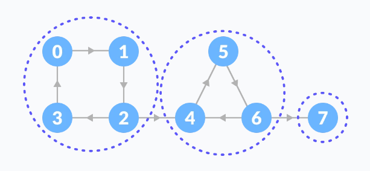

### Spanning Trees
- A spanning tree is a sub-graph of an undirected connected graph, which includes all the vertices of the graph with a minimum possible number of edges. If a vertex is missed, then it is not a spanning tree.
- Or in simple words, A spanning tree is a sub-graph of an undirected connected graph, in which we have N vertices & N-1 edges & all nodes are reachable from each other.
- If there are N vertices, then edges will be N-1
- The edges may or may not have weights assigned to them.
```
The total number of spanning trees with n vertices that can be created 
from a complete graph is equal to n(n-2).
```

### Minimum Spanning Tree
A minimum spanning tree is a spanning tree in which the sum of the weight of the edges is as minimum as possible.

The minimum spanning tree from a graph is found using the following algorithms:
1. Prim's Algorithm
2. Kruskal's Algorithm

### Spanning Tree Applications
- Computer Network Routing Protocol 
- Cluster Analysis 
- Civil Network Planning

### Minimum Spanning tree Applications
- To find paths in the map
- To design networks like telecommunication networks, water supply networks, and electrical grids.

### Strongly Connected Components
- A strongly connected component is the portion of a directed graph in which there is a path from each vertex to another vertex. It is applicable only on a directed graph.

- You can observe that in the first strongly connected component, every vertex can reach the other vertex through the directed path. 
- These components can be found using Kosaraju's Algorithm.

### Strongly Connected Components Applications
- Vehicle routing applications
- Maps
- Model-checking in formal verification