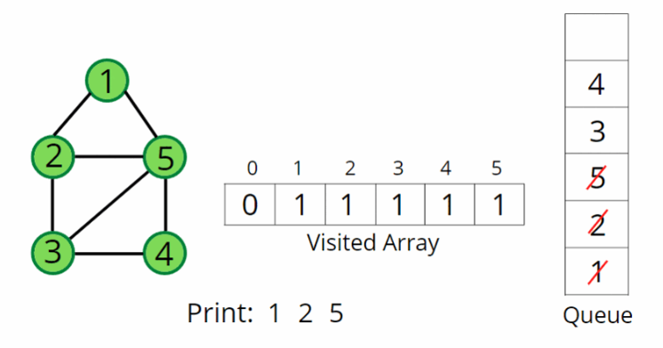

### Question
- Given an undirected/directed graph. The task is to do Breadth First Traversal of this graph starting from 0. 
- Note: One can move from node u to node v only if there's an edge from u to v. Find the BFS traversal of the graph starting from the 0th vertex, from left to right according to the input graph. Also, you should only take nodes directly or indirectly connected from Node 0 in consideration.

### Sample Input
    V=5, list= [[0,1],[0,2],[0,3],[2,4]]
    V=3, list= [[0,1],[0,2]]

### Sample Output
    0 1 2 3 4
    0 1 2

### Solution
- In BFS, we start with a “starting” node, mark it as visited, and push it into the queue data structure. 
- In every iteration, we pop out the node ‘v’ and put it in the solution vector, as we are traversing this node. 
- All the unvisited adjacent nodes from ‘v’ are visited next and are pushed into the queue. The list of adjacent neighbors of the node can be accessed from the adjacency list. 
- Repeat above steps until the queue becomes empty, and this way you can easily traverse all the nodes in the graph.

### Code
    public ArrayList<Integer> bfsOfGraph(int V, ArrayList<ArrayList<Integer>> adj){
        ArrayList<Integer> res= new ArrayList<>();
        Queue<Integer> q= new LinkedList<>();
        boolean[] vis= new boolean[V];

        q.add(0);
        vis[0]=true;

        while (!q.isEmpty()){
            Integer node=q.poll();
            res.add(node);
            for (Integer it : adj.get(node)) {
                if (!vis[it]){
                    vis[it]=true;
                    q.add(it);
                }
            }
        }
        return res;
    }

### Other Techniques
- NA

### Complexity
1. Time Complexity - O(N) + O(2E)
2. Space Complexity - O(3N)