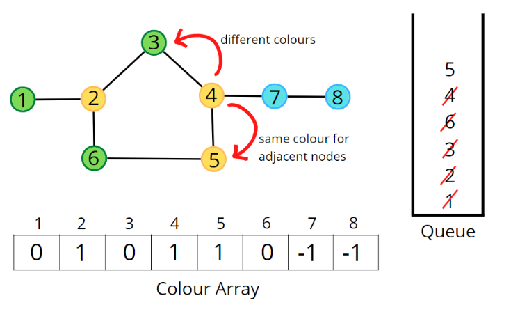

### Question
- There is an undirected graph with n nodes, where each node is numbered between 0 and n - 1. You are given a 2D array graph, where graph[u] is an array of nodes that node u is adjacent to. More formally, for each v in graph[u], there is an undirected edge between node u and node v. The graph has the following properties:
  - There are no self-edges (graph[u] does not contain u). 
  - There are no parallel edges (graph[u] does not contain duplicate values). 
  - If v is in graph[u], then u is in graph[v] (the graph is undirected). 
  - The graph may not be connected, meaning there may be two nodes u and v such that there is no path between them. 
- A graph is bipartite if the nodes can be partitioned into two independent sets A and B such that every edge in the graph connects a node in set A and a node in set B.
- Return true if and only if it is bipartite.

### Sample Input
    graph = [[1,2,3],[0,2],[0,1,3],[0,2]]
    graph = [[1,3],[0,2],[1,3],[0,2]]

### Sample Output
    false
    true

### Solution
- In a Bipartite graph, suppose if there are two colors available to us then, no two adjacent nodes can be of same color
- Most important observation is, graph is not Bipartite if it has a cycle of odd length.
- In the BFS method, we will create a new array 'color' & initialise it with -1. This array will mark the color coded to each node
- Then for each node, we will check if its color=-1 then we will do a bfs traversal, if bfs fails then we return false, else return true
- The BFS traversal takes a Queue, it initially colors the first node as 1, and adds the node to queue
- Then till queue is not empty, it pops out from queue, and checks the neighbour of the popped node
- If the color of any of the neighbour is -1, then they will be marked as opposite color of the current node by doing 1-color[cur], then we will add the neighbours in the queue too
- At any point if the color of neighbour & color of current node is same, that means it is violating our condition of bipartite, so we return false

### Code
    public static boolean isBipartite(int[][] graph){
        int[] color= new int[graph.length];
        Arrays.fill(color, -1);
        for (int i = 0; i < graph.length; i++) {
            if (color[i] == -1){
                if (!bfsCheck(graph, i, color)){
                    return false;
                }
            }
        }
        return true;
    }

    private static boolean bfsCheck(int[][] graph, int node, int[] color) {
        Queue<Integer> q= new LinkedList<>();
        color[node]=1;
        q.add(node);
        while (!q.isEmpty()){
            int cur= q.poll();
            for (int neighbour : graph[cur]){
                if (color[neighbour]==-1){
                    color[neighbour] = 1 - color[cur];
                    q.add(neighbour);
                }else if (color[neighbour]==color[cur]){
                    return false;
                }
            }
        }
        return true;
    }

### Other Techniques
- DFS

### Complexity
1. Time Complexity - O(V+2E)
2. Space Complexity - O(3V)