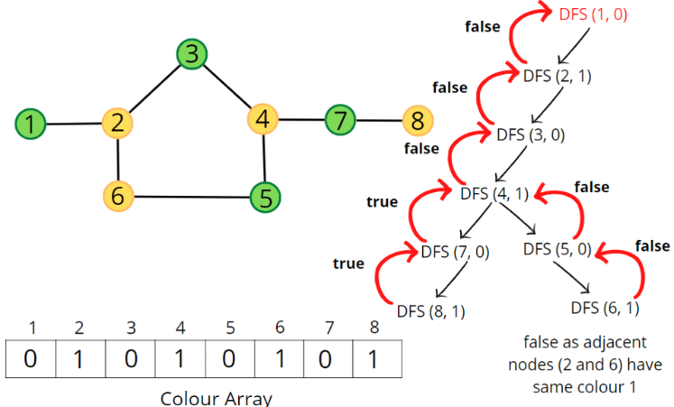

### Question
- There is an undirected graph with n nodes, where each node is numbered between 0 and n - 1. You are given a 2D array graph, where graph[u] is an array of nodes that node u is adjacent to. More formally, for each v in graph[u], there is an undirected edge between node u and node v. The graph has the following properties:
    - There are no self-edges (graph[u] does not contain u).
    - There are no parallel edges (graph[u] does not contain duplicate values).
    - If v is in graph[u], then u is in graph[v] (the graph is undirected).
    - The graph may not be connected, meaning there may be two nodes u and v such that there is no path between them.
- A graph is bipartite if the nodes can be partitioned into two independent sets A and B such that every edge in the graph connects a node in set A and a node in set B.
- Return true if and only if it is bipartite.

### Sample Input
    graph = [[1,2,3],[0,2],[0,1,3],[0,2]]
    graph = [[1,3],[0,2],[1,3],[0,2]]

### Sample Output
    false
    true

### Solution
- In a Bipartite graph, suppose if there are two colors available to us then, no two adjacent nodes can be of same color
- Most important observation is, graph is not Bipartite if it has a cycle of odd length.
- For DFS traversal, we need a start node and a visited array but in this case, instead of a visited array, we will take a colour array where all the nodes are initialised to -1 indicating they are not coloured yet.
- We will traverse the graph & for each node, we will check if its color=-1 then do DFS traversal, if it returns false, then our answer is false
- The DFS Traversal, will traverse on each neighbour of current node, & if color of neighbour = -1, then we will color it opposite of the current node using 1-color[node]
- Now we will recursively check for the neighbours of the current neighbour, i.e., we are making a call to the neighbours of the current neighbour by making it current node
- If any of the calls give false as answer then return false
- Also if at any point color[neighbour] is same as color[currentNode] then it is violating rules for a bipartite graph then return false (this is like the base case of our dfs call)

### Code
    public static boolean isBipartite(int[][] graph){
        int[] color= new int[graph.length];
        Arrays.fill(color, -1);
        for (int i = 0; i < graph.length; i++) {
            if(color[i]==-1){
                if (!dfsCheck(graph, i, color)){
                    return false;
                }
            }
        }
        return true;
    }

    private static boolean dfsCheck(int[][] graph, int node, int[] color) {
        for (int neighbour : graph[node]){
            if (color[neighbour] == -1){
                color[neighbour] = 1 - color[node];
                if (!dfsCheck(graph, neighbour, color)){
                    return false;
                }
            }else if (color[neighbour] == color[node]){
                return false;
            }
        }
        return true;
    }

### Other Techniques
- DFS

### Complexity
1. Time Complexity - O(V+2E)
2. Space Complexity - O(3V)