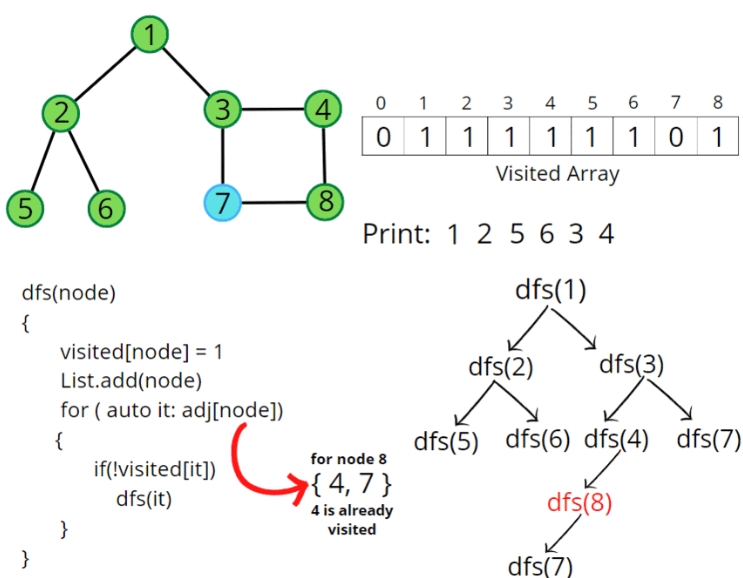

### Question
- You are given a connected undirected graph. Perform a Depth First Traversal of the graph. 
- Note: Use a recursive approach to find the DFS traversal of the graph starting from the 0th vertex from left to right according to the graph.

### Sample Input
    V = 5 , adj = [[2,3,1] , [0], [0,4], [0], [2]]
    V = 4, adj = [[1,3], [2,0], [1], [0]]

### Sample Output
    0 2 4 3 1
    0 1 2 3

### Solution
- In DFS, we start with a node ‘v’, mark it as visited and store it in the solution vector.
- It is unexplored as its adjacent nodes are not visited. 
- We run through all the adjacent nodes, and call the recursive dfs function to explore the node ‘v’ which has not been visited previously. This leads to the exploration of another node ‘u’ which is its adjacent node and is not visited. 
- The adjacency list stores the list of neighbours for any node. Pick the neighbour list of node ‘v’ and run a for loop on the list of neighbours (say nodes ‘u’ and ‘w’ are in the list). We go in-depth with each node. When node ‘u’ is explored completely then it backtracks and explores node ‘w’. 
- This traversal terminates when all the nodes are completely explored.
  

### Code
    public static ArrayList<Integer> dfsOfGraph(int V, ArrayList<ArrayList<Integer>> adj){
        boolean[] vis= new boolean[V];
        ArrayList<Integer> res= new ArrayList<>();

        for (int i = 0; i < V; i++) {
            if (!vis[i]){
                dfs(i,vis,adj,res);
            }
        }
        return res;
    }

    private static void dfs(int node, boolean[] vis, ArrayList<ArrayList<Integer>> adj, ArrayList<Integer> res) {
        if (vis[node]) return;

        res.add(node);
        vis[node]=true;

        for (Integer it: adj.get(node)){
            if (!vis[it]){
                dfs(it, vis, adj, res);
            }
        }
    }

### Other Techniques
- NA

### Complexity
1. Time Complexity - O(N) + O(2E)
2. Space Complexity - O(3N)