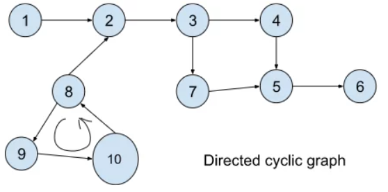
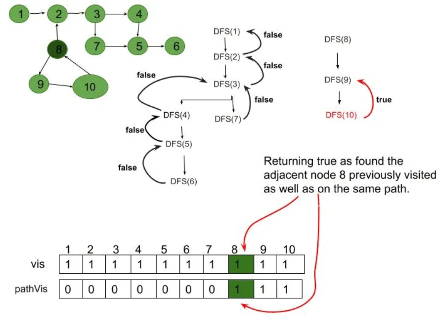

### Question
- Given a Directed Graph with V vertices (Numbered from 0 to V-1) and E edges, check whether it contains any cycle or not.

### Sample Input
    graph = [[1],[2],[3],[3]]
    graph = [[1],[2]]

### Sample Output
    true
    false

### Solution
- In a Directed Cyclic Graph, during traversal, if we end up at a node, which we have visited previously in the path, that means we came around a circle and ended up at this node, which determines that it has a cycle. This works for Undirected cyclic graphs too.
- But in some cases of directed cyclic graph, we may reach the same node again but the path may be different, which means we ended up on same node, but it's not necessarily mean that it has cycle

- For eg- here we can reach node(5), through different paths but it isn't cycle
- The important observation is that, for a directed graph to be cyclic, we must reach the same node again, through the same path we are already following like 8->9->10->8

### Algorithm
- We will traverse the graph component-wise using the DFS technique.
- Make sure to carry two visited arrays in the DFS call. One is a visited array(vis) and the other is a path-visited(pathVis) array. The visited array keeps a track of visited nodes, and the path-visited keeps a track of visited nodes in the current traversal only.
- While making a DFS call, at first we will mark the node as visited in both the arrays and then will traverse through its adjacent nodes. Now, there may be either of the three cases:
  - Case 1: If the adjacent node is not visited, we will make a new DFS call recursively with that particular node. 
  - Case 2: If the adjacent node is visited and also on the same path(i.e marked visited in the pathVis array), we will return true, because it means it has a cycle, thereby the pathVis was true. Returning true will mean the end of the function call, as once we have got a cycle, there is no need to check for further adjacent nodes. 
  - Case 3: If the adjacent node is visited but not on the same path(i.e not marked in the pathVis array), we will continue to the next adjacent node, as it would have been marked as visited in some other path, and not on the current one. 
- Finally, if there are no further nodes to visit, we will unmark the current node in the pathVis array and just return false. Then we will backtrack to the previous node with the returned value. The point to remember is, while we enter we mark both the pathVis and vis as true, but at the end of traversal to all adjacent nodes, we just make sure we unmark the pathVis and still keep the vis marked as true, as it will avoid future extra traversal calls.

### Code
    public boolean isCyclic(int V, ArrayList<ArrayList<Integer>> adj) {
        int[] vis= new int[V];
        int[] pathVis= new int[V];

        for (int i = 0; i < V; i++) {
            if (vis[i]==0){
                if (dfsCheck(i, adj, vis, pathVis)){
                    return true;
                }
            }
        }
        return false;
    }

    private boolean dfsCheck(int node, ArrayList<ArrayList<Integer>> adj, int[] vis, int[] pathVis) {
        vis[node]=1;
        pathVis[node]=1;

        for (int it : adj.get(node)){
            if (vis[it]==0){
                if (dfsCheck(it, adj, vis, pathVis)){
                    return true;
                }
            }else if (pathVis[it]==1){
                return true;
            }
        }
        pathVis[node]=0;
        return false;
    }

### Other Techniques
- DFS

### Complexity
1. Time Complexity - O(V+E) + O(V)
2. Space Complexity - O(3V)