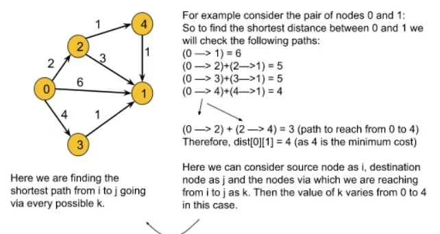

### Question
- The problem is to find the shortest distances between every pair of vertices in a given edge-weighted directed graph. The graph is represented as an adjacency matrix of size n*n. Matrix[i][j] denotes the weight of the edge from i to j. If Matrix[i][j]=-1, it means there is no edge from i to j. 
- Do it in-place.

### Sample Input
    matrix = {{0,25},{-1,0}}
    matrix = {{0,1,43},{1,0,6},{-1,-1,0}}

### Sample Output
    {{0,25},{-1,0}}
    {{0,1,7},{1,0,6},{-1,-1,0}}

### About Floyd Warshall's Algorithm
- Floyd Warshall algorithm is a multi-source shortest path algorithm and it helps to detect negative cycles as well. The shortest path between node u and v necessarily means the path(from u to v) for which the sum of the edge weights is minimum. 
- In Floyd Warshall’s algorithm, we need to check every possible path going via each possible node. And after checking every possible path, we will figure out the shortest path(a kind of brute force approach to find the shortest path).

- rom the above example we can derive the following formula:
  matrix[i][j] =min(matrix[i][j], matrix[i ][k]+matrix[k][j]), where i = source node, j = destination node, and k = the node via which we are reaching from i to j. 
- Here we will calculate dist[i][j] for every possible node k (k = 0, 1….V, where V = no. of nodes), and will select the minimum value as our result. 
- In order to apply this algorithm to an undirected graph, we just need to convert the undirected edges into directed edges
- If we find that the cost of reaching any node from itself is less than 0, we can conclude that the graph has a negative cycle.

### Solution
- We will use an adjacency matrix in this question. The adjacency matrix should store the edge weights for the given edges and the rest of the cells must be initialized with infinity().
- After having set the adjacency matrix accordingly, we will run a loop from 0 to V-1(V = no. of vertices). In the kth iteration, this loop will help us to check the path via node k for every possible pair of nodes. Basically, this loop will change the value of k in the formula. 
- Inside the loop, there will be two nested loops for generating every possible pair of nodes(Nothing but to visit each cell of a 2D matrix using the nested loop). Among these two loops, the first loop will change the value of i and the second one will change the value of j in the formula. 
- Inside these nested loops, we will apply the above formula to calculate the shortest distance between the pair of nodes. 
- Finally, the adjacency matrix will store all the shortest paths. For example, matrix[i][j] will store the shortest path from node i to node j.
- If we want to check for negative cycle then, After completing the steps(outside those three loops), we will run a loop and check if any cell having the row and column the same(i = j) contains a value less than 0.

### Code
    public void shortest_distance(int[][] matrix){
        int n= matrix.length;
        for (int i = 0; i < n; i++) {
            for (int j = 0; j < n; j++) {
                if (matrix[i][j]==-1){
                    matrix[i][j]=(int)1e9;
                }
                if (i==j) matrix[i][j]=0;
            }
        }

        for (int k=0; k<n; k++){
            for (int i = 0; i < n; i++) {
                for (int j = 0; j < n; j++) {
                    matrix[i][j]=Math.min(matrix[i][j], matrix[i][k]+matrix[k][j]);
                }
            }
        }

        //if we need to detect negative edge cycle
        for (int i = 0; i < n; i++) {
            if (matrix[i][i]<0){
                System.out.println("Contains negative edge cycle");
            }
        }

        //as described in question, if there is no edge between u & v, return -1
        for (int i = 0; i < n; i++) {
            for (int j = 0; j < n; j++) {
                if (matrix[i][j]==(int)1e9){
                    matrix[i][j]=-1;
                }
            }
        }
    }

### Other Techniques
- NA

### Complexity
1. Time Complexity - O(V^3)
2. Space Complexity - O(V^2)