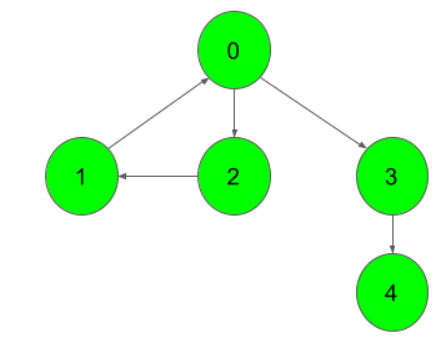
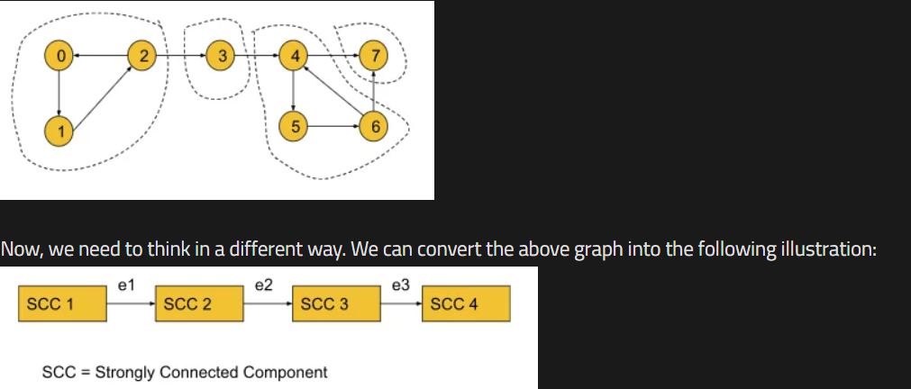
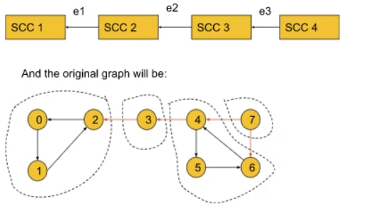

### Question
- Given a Directed Graph with V vertices (Numbered from 0 to V-1) and E edges, Find the number of strongly connected components in the graph.
- A component is called a Strongly Connected Component(SCC) only if for every possible pair of vertices (u, v) inside that component, u is reachable from v and v is reachable from u.
- By definition, a component containing a single vertex is always a strongly connected component.

### Sample Input

### Sample Output
    3

### Intuition
- Before understanding the algorithm, we are going to discuss the thought process behind it. If we start DFS from node 0 for the following graph, we will end up visiting all the nodes. So, it is impossible to differentiate between different SCCs.
  
- But if we reverse the edges e1, e2, and e3, the graph will look like the following:
  
- Now in this graph, if we start DFS from node 0 it will visit only the nodes of SCC1. Similarly, if we start from node 3 it will visit only the nodes of SCC2. Thus, by reversing the SCC-connecting edges, the adjacent SCCs become unreachable. Now, the DFS will work in such a way, that in one DFS call we can only visit the nodes of a particular SCC. So, the number of DFS calls will represent the number of SCCs.
- Until now, we have successfully found out the process of getting the number of SCCs. But here, comes a new problem i.e. if we do not know the SCCs, how the edges will be reversed? To solve this problem, we will simply try to reverse all the edges of the graph
- If we carefully observe, the nodes within an SCC are reachable from each one to everyone even if we reverse the edges of the SCC. So, the SCCs will have no effect on reversing the edges.
- Now, the question might be like, if node 0 is located in SCC4 and we start DFS from node 0, again we will visit all the SCCs at once even after reversing the edges. This is where the starting time and the finishing time concept will come in.

### Solution
- Sort all the nodes according to their finishing time: To sort all the nodes according to their finishing time, we will start DFS from node 0 and while backtracking in the DFS call we will store the nodes in a stack data structure. The nodes in the last SCC will finish first and will be stored in the last of the stack. After the DFS gets completed for all the nodes, the stack will be storing all the nodes in the sorted order of their finishing time. 
- Reverse all the edges of the entire graph:
  Now, we will create another adjacency list and store the information of the graph in a reversed manner. 
- Perform the DFS and count the no. of different DFS calls to get the no. of SCC:
  Now, we will start DFS from the node which is on the top of the stack and continue until the stack becomes empty. For each individual DFS call, we will increment the counter variable by 1. We will get the number of SCCs by just counting the number of individual DFS calls as in each individual DFS call, all the nodes of a particular SCC get visited. 
- Finally, we will get the number of SCCs in the counter variable. If we want to store the SCCs as well, we need to store the nodes in some array during each individual DFS call in step 3.

### Code
    public int kosaraju(int V, ArrayList<ArrayList<Integer>> adj){
        boolean[] vis = new boolean[V];
        Stack<Integer> st= new Stack<>();
        for (int i = 0; i < V; i++) {
            if (!vis[i]){
                sortInFinishingTime(i, vis, adj, st);
            }
        }

        //Reverse the graph, in a different transposed adjacency list
        ArrayList<ArrayList<Integer>> adjT = new ArrayList<>();
        for (int i=0; i< V; i++) adjT.add(new ArrayList<Integer>());
        for (int i=0; i<V; i++){
            vis[i]=false;
            for (Integer it : adj.get(i)){
                adjT.get(it).add(i);
            }
        }

        int count=0;
        while (!st.isEmpty()){
            int node = st.pop();
            if (!vis[node]){
                count++;
                dfs(node, vis, adjT);
            }
        }
        return count;
    }

    private void dfs(int node, boolean[] vis, ArrayList<ArrayList<Integer>> adjT) {
        vis[node]=true;
        for (Integer it : adjT.get(node)){
            if (!vis[it]){
                dfs(it, vis, adjT);
            }
        }
    }

    private void sortInFinishingTime(int node, boolean[] vis, ArrayList<ArrayList<Integer>> adj, Stack<Integer> st) {
        vis[node]=true;
        for (Integer it : adj.get(node)){
            if (!vis[it]){
                sortInFinishingTime(it, vis, adj, st);
            }
        }
        st.push(node);
    }

### Other Techniques
- NA

### Complexity
1. Time Complexity - O(V+E)
2. Space Complexity - O(V+E)+O(2V)