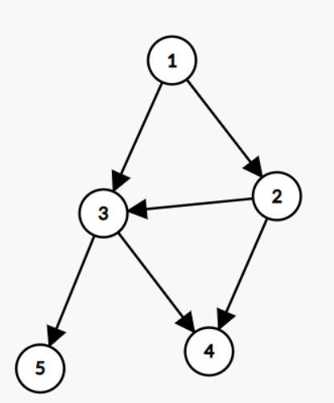
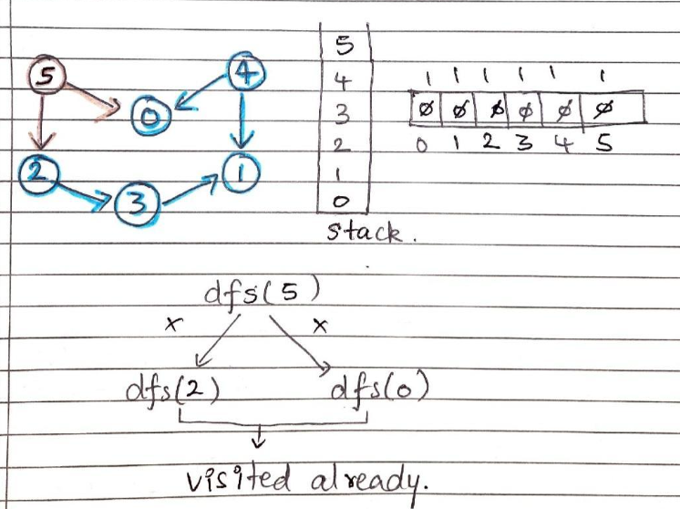

### Question
- Given a Directed Acyclic Graph (DAG) with V vertices and E edges, Find any Topological Sorting of that Graph.

### Sample Input

### Sample Output
    One of the solutions is 1,2,3,5,4

### Solution
- Topological Sorting means linear ordering of vertices such that there is an edge u—-> v, u appears before v in the ordering. There can be multiple toposorts order for the given graph but the condition should be if there is an edge u->v then u should always appear before v.
- Topological Sorting is applicable only for DAG(Directed Acyclic Graph)
- We will use a visited array & a stack
- We will traverse the edges & if the node is not visited, then we use dfs in it & mark it visited
- we recursively traverse to the neighbours through dfs
- At the end we will just traverse the stack which will automatically have our topological sort

### Code
    static int[] topoSort(int V, ArrayList<ArrayList<Integer>> adj) {
        int[] visited= new int[V];
        Stack<Integer> st= new Stack<>();
        for (int i = 0; i < V; i++) {
            if (visited[i]==0){
                topoDFS(i, visited, adj, st);
            }
        }

        int[] topo= new int[V];
        int ind=0;
        while (!st.isEmpty()){
            topo[ind++]=st.pop();
        }
        return topo;
    }

    private static void topoDFS(int node, int[] visited, ArrayList<ArrayList<Integer>> adj, Stack<Integer> st) {
        visited[node]=1;
        for (Integer it : adj.get(node)){
            if (visited[it]==0){
                topoDFS(it, visited, adj, st);
            }
        }
        st.push(node);
    }

### Other Techniques
- NA

### Complexity
1. Time Complexity - O(N+E)
2. Space Complexity - O(2N)