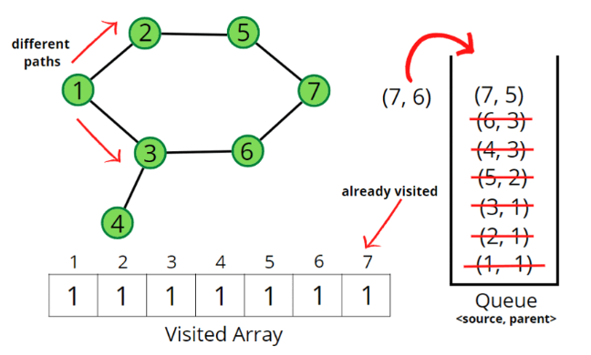

### Question
- Given an undirected graph with V vertices and E edges, check whether it contains any cycle or not. Graph is in the form of adjacency list where adj[i] contains all the nodes ith node is having edge with.

### Sample Input
    V = 5, adj = {{1}, {0, 2, 4}, {1, 3}, {2, 4}, {1, 3}}
    V = 4, adj = {{}, {2}, {1, 3}, {2}}

### Sample Output
    true
    false

### Solution
- First of all graph can have connected components as well, in that case even if one of the components has cycle, we return true. For that, we will keep a visited array of size V, and run for loop, if the node is not visited, we run checkForCycle() function
- In checkForCycle() we will do a BFS Traversal, we will use a Queue ds in which we will store Pair(source, parent)
- Push the pair of the source node and its parent data (<source, parent>) in the queue, and mark the node as visited. The parent will be needed so that we don’t do a backward traversal in the graph, we just move frontwards. 
- Start the BFS traversal, pop out an element from the queue every time and travel to all its unvisited neighbors using an adjacency list. 
- Repeat the steps either until the queue becomes empty, or a node appears to be already visited which is not the parent, even though we traveled in different directions during the traversal, indicating there is a cycle. 
- If the queue becomes empty and no such node is found then there is no cycle in the graph.

### Code
    static class Pair{
        int first, second;
        public Pair(int first, int second){
            this.first=first;
            this.second=second;
        }
    }
    public boolean isCycle(int V, ArrayList<ArrayList<Integer>> adj) {
        boolean[] vis= new boolean[V];
        for (int i = 0; i < V; i++) {
            if (!vis[i]){
                if (checkForCycle(adj, i, vis)){
                    return true;
                }
            }
        }
        return false;
    }

    private boolean checkForCycle(ArrayList<ArrayList<Integer>> adj, int el, boolean[] vis) {
        Queue<Pair> q= new LinkedList<>();
        q.add(new Pair(el, 1));
        vis[el]=true;

        while (!q.isEmpty()){
            int node = q.peek().first;
            int parent= q.peek().second;
            q.remove();

            for (Integer it: adj.get(node)){
                if (!vis[it]){
                    q.add(new Pair(it, node));
                    vis[it]=true;
                }
                else if (parent!=it){
                    return true;
                }
            }
        }
        return false;
    }

### Other Techniques
- NA

### Complexity
1. Time Complexity - O(N + 2E) + O(N)
2. Space Complexity - O(2N)