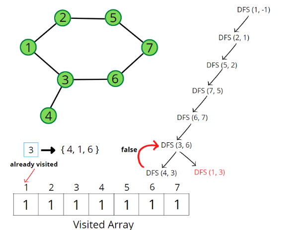

### Question
- Given an undirected graph with V vertices and E edges, check whether it contains any cycle or not. Graph is in the form of adjacency list where adj[i] contains all the nodes ith node is having edge with.

### Sample Input
    V = 5, adj = {{1}, {0, 2, 4}, {1, 3}, {2, 4}, {1, 3}}
    V = 4, adj = {{}, {2}, {1, 3}, {2}}

### Sample Output
    true
    false

### Solution
- First of all graph can have connected components as well, in that case even if one of the components has cycle, we return true. For that, we will keep a visited array of size V, and run for loop, if the node is not visited, we run checkForCycle() function
- In the DFS function call i.e., checkForCycle(), make sure to store the parent data along with the source node, create a visited array, and initialize to 0. The parent is stored so that while checking for re-visited nodes, we don’t check for parents. 
- We run through all the unvisited adjacent nodes using an adjacency list and call the recursive dfs function. Also, mark the node as visited. 
- If we come across a node that is already marked as visited and is not a parent node, then keep on returning true indicating the presence of a cycle; otherwise return false after all the adjacent nodes have been checked and we did not find a cycle.

### Code
    public static boolean isCycle(int V, ArrayList<ArrayList<Integer>> adj){
        boolean[] vis= new boolean[V];
        for (int i = 0; i < V; i++) {
            if (!vis[i]){
                if (checkForCycle(i, -1, vis, adj)){
                    return true;
                }
            }
        }
        return false;
    }

    private static boolean checkForCycle(int node, int parent, boolean[] vis, ArrayList<ArrayList<Integer>> adj) {
        vis[node]=true;
        for (Integer it: adj.get(node)){
            if (!vis[it]){
                if (checkForCycle(it, node, vis, adj)){
                    return true;
                }
            }else if(parent!=it){
                return true;
            }
        }
        return false;
    }

### Other Techniques
- NA

### Complexity
1. Time Complexity - O(N + 2E) + O(N)
2. Space Complexity - O(2N)