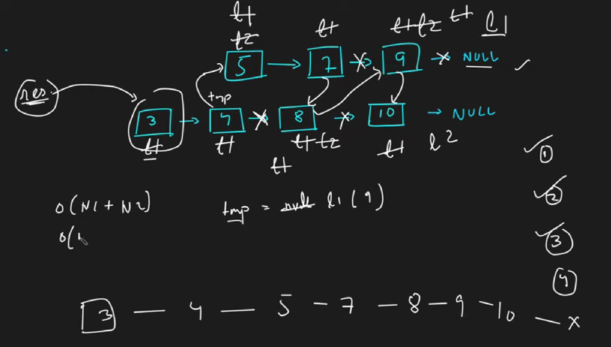

### Question
- You are given the heads of two sorted linked lists list1 and list2. 
- Merge the two lists in a one sorted list. The list should be made by splicing together the nodes of the first two lists. 
- Return the head of the merged linked list.

### Sample Input
    list1 = [1,2,4], list2 = [1,3,4]
    list1 = [], list2 = []

### Sample Output
    [1,1,2,3,4,4]
    []

### Solution
- We will always traverse using the list1 ptr, so initially we must point list1 to the smallest value among the two LL
- Now create a new node res, pointing to list1, this is our required result
- now traverse the lists, create a tempNode = list1, & keep traversing with list1 till it is not null and its value is less than list2
- tempNode will automatically point to the last node in list1 which will be pointed to next element
- whenever list2 val < list1 val, we will point tempNode.next=list2 pointer
- Now we will swap both the list pointers, so that list1 can again point to the smallest of the two values & repeat the steps

### Code
    public ListNode mergeTwoLists(ListNode list1, ListNode list2) {
        if(list1==null) return list2;
        if(list2==null) return list1;

        if(list1.val> list2.val){
            ListNode temp=list1;
            list1=list2;
            list2=temp;
        }

        ListNode res=list1;
        while (list1!=null && list2!=null){
            ListNode tempNode=null;
            while (list1!=null && list1.val<= list2.val){
                tempNode=list1;
                list1=list1.next;
            }
            tempNode.next=list2;
            ListNode temp=list1;
            list1=list2;
            list2=temp;
        }
        return res;
    }

### Edge Cases
- if one list is empty, return another one

### Other Techniques
- Use a new LinkedList and add sorted element in that

### Complexity
1. Time Complexity - O(N+M)
2. Space Complexity - O(1)