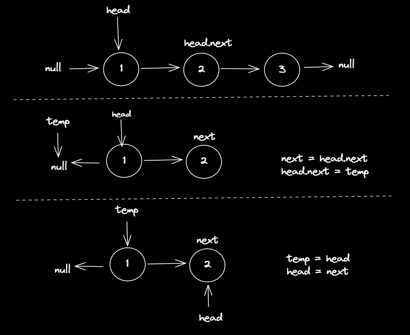

### Question
- Given the head of a singly linked list, reverse the list, and return the reversed list.

### Sample Input
    [1,2,3,4,5]
    [1,2]
    []

### Sample Output
    [5,4,3,2,1]
    [2,1]
    []

### Solution
- Create a new node temp=null
- Traverse the list, till head points again to null
- point a new node next=head.next to not lose head.next
- now point head.next = temp
- make temp as new head, and head as new next
- 

### Code
    public ListNode reverseList(ListNode head) {
        if (head==null) return head;
        ListNode temp=null;
        while (head!=null){
            ListNode next=head.next;
            head.next=temp;
            temp=head;
            head=next;
        }
        return temp;
    }

### Edge Cases
- if there's no item present return head, which is null

### Other Techniques
- Can be done using Recursion

### Complexity
1. Time Complexity - O(N)
2. Space Complexity - O(1)