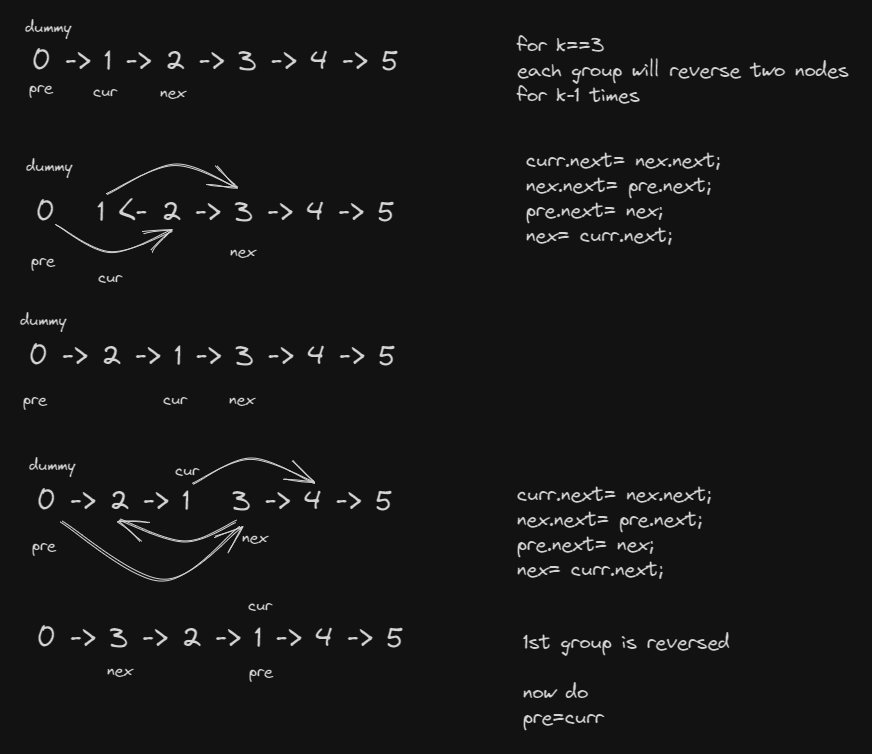

### Question
- Given the head of a linked list, reverse the nodes of the list k at a time, and return the modified list. 
- k is a positive integer and is less than or equal to the length of the linked list. If the number of nodes is not a multiple of k then left-out nodes, in the end, should remain as it is. 
- You may not alter the values in the list's nodes, only nodes themselves may be changed.

### Sample Input
    head = [1,2,3,4,5], k = 2
    head = [1,2,3,4,5], k = 3

### Sample Output
    [2,1,4,3,5]
    [3,2,1,4,5]

### Solution
- First of all we will find the length of given list (as if we have at the end, remaining nodes < k, we shouldn't reverse it and return as it is)
- Next we will create a dummy node & take three pointers pre, cur, next
- while our length >= k traverse the list
- We will reverse 2 nodes for k-1 times, in order to properly reverse a group of size k
- then decrement our length by k

### Code
    public ListNode reverseKGroup(ListNode head, int k){
        if (head== null || head.next== null) return head;
        int length= lengthOfList(head);
        ListNode dummy= new ListNode(0, head);
        ListNode pre= dummy;
        ListNode curr, nex;

        while (length>=k){
            curr= pre.next;
            nex= curr.next;
            for (int i = 1; i < k; i++) {
                curr.next= nex.next;
                nex.next= pre.next;
                pre.next= nex;
                nex= curr.next;
            }

            pre =curr;
            length-=k;
        }
        return dummy.next;
    }

    private int lengthOfList(ListNode head) {
        int len=0;
        while (head!=null){
            ++len;
            head= head.next;
        }
        return len;
    }

### Edge Cases
- NA

### Other Techniques
- NA

### Complexity
1. Time Complexity - O(N)
2. Space Complexity - O(1)