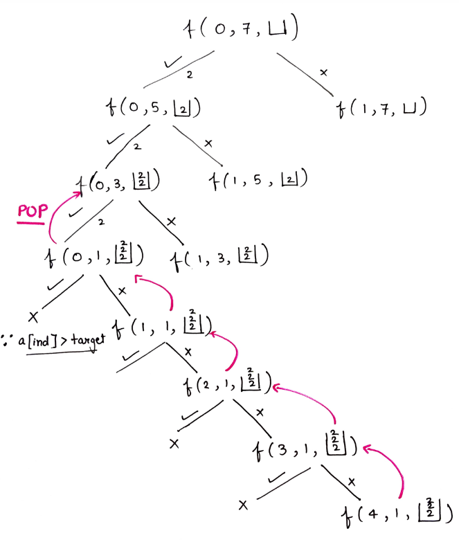

### Question
- Given an array of distinct integers candidates and a target integer target, return a list of all unique combinations of candidates where the chosen numbers sum to target. You may return the combinations in any order. 
- The same number may be chosen from candidates an unlimited number of times. Two combinations are unique if the frequency of at least one of the chosen numbers is different.

### Sample Input
    candidates = [2,3,6,7], target = 7
    candidates = [2,3,5], target = 8

### Sample Output
    [[2,2,3],[7]]
    [[2,2,2,2],[2,3,3],[3,5]]

### Solution
- Initially, the index will be 0, target as given and the data structure(vector or list) will be empty 
- Now there are 2 options viz to pick or not pick the current index element. 
- If you pick the element, again come back at the same index as multiple occurrences of the same element is possible so the target reduces to target – arr[index] (where target -arr[index]>=0)and also insert the current element into the data structure. 
- If you decide not to pick the current element, move on to the next index and the target value stays as it is. Also, the current element is not inserted into the data structure. 
- While backtracking makes sure to pop the last element as shown in the recursion tree below. 
- Keep on repeating this process while index < size of the array for a particular recursion call.

### Code
    public List<List<Integer>> combinationSum(int[] candidates, int target) {
        List<List<Integer>> ans=new ArrayList<>();
        findCombinations(0,candidates,target,ans,new ArrayList<>());
        return ans;
    }

    private void findCombinations(int ind, int[] arr, int target, List<List<Integer>> ans, List<Integer> list) {
        if (ind== arr.length){
            if (target==0){
                ans.add(new ArrayList<>(list));
            }
            return;
        }

        if (arr[ind]<=target){
            list.add(arr[ind]);
            findCombinations(ind,arr,target-arr[ind],ans,list);
            list.remove(list.size()-1);
        }
        findCombinations(ind+1,arr,target,ans,list);
    }

### Other Techniques
- NA

### Complexity
1. Time Complexity - O(2^t * k) where t is the target, k is the average length
2. Space Complexity - O(k*x), k is the average length and x is the no. of combinations