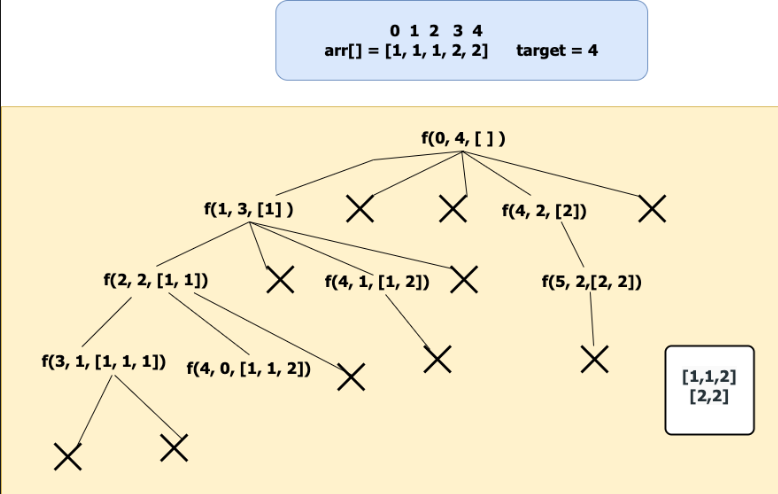

### Question
- Given a collection of candidate numbers (candidates) and a target number (target), find all unique combinations in candidates where the candidate numbers sum to target. 
- Each number in candidates may only be used once in the combination. 
- Note: The solution set must not contain duplicate combinations.

### Sample Input
    candidates = [10,1,2,7,6,1,5], target = 8
    candidates = [2,5,2,1,2], target = 5

### Sample Output
    [[1,1,6],[1,2,5],[1,7],[2,6]]
    [[1,2,2],[5]]

### Solution
- Before starting the recursive call make sure to sort the elements because the ans should contain the combinations in sorted order and should not be repeated. 
- Initially, We start with the index 0, At index 0 we have n – 1 way to pick the first element of our subsequence. 
- Check if the current index value can be added to our ds. If yes add it to the ds and move the index by 1. while moving the index skip the consecutive repeated elements because they will form duplicate sequences. 
- Reduce the target by arr[i],call the recursive call for f(idx + 1,target – 1,ds,ans) after the call make sure to pop the element from the ds.(By seeing the example recursive You will understand). 
- if(arr[i] > target) then terminate the recursive call because there is no use to check as the array is sorted in the next recursive call the index will be moving by 1 all the elements to its right will be in increasing order.

### Code
    public List<List<Integer>> combinationSum2(int[] candidates, int target) {
        List<List<Integer>> ans=new ArrayList<>();
        Arrays.sort(candidates);
        findCombinations(0,candidates,target,ans,new ArrayList<>());
        return ans;
    }

    private void findCombinations(int index, int[] candidates, int target, List<List<Integer>> ans, ArrayList<Integer> list) {
        if (target==0){
            ans.add(new ArrayList<>(list));
            return;
        }
        for (int i = index; i < candidates.length; i++) {
            if (i>index && candidates[i]==candidates[i-1]) continue;
            if (candidates[i]>target) break;

            list.add(candidates[i]);
            findCombinations(i+1,candidates,target-candidates[i],ans,list);
            list.remove(list.size()-1);
        }
    }

### Other Techniques
- using Hashset to avoid Duplicates

### Complexity
1. Time Complexity - O(2^n * k), where k is average space for ds
2. Space Complexity - O(k*x), k is the average length and x is the no. of combinations