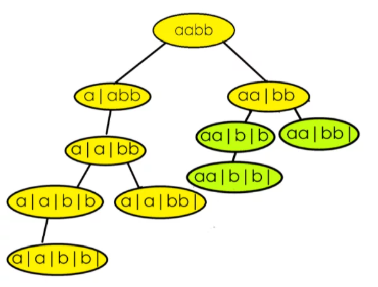

### Question
- Given a string s, partition s such that every substring of the partition is a palindrome. Return all possible palindrome partitioning of s.

### Sample Input
    "aab"
    "a"

### Sample Output
    [["a","a","b"],["aa","b"]]
    [["a"]]

### Solution
- we will traverse the string, each character one by one and create partition
- at each partition, we will check if palindrome can be formed
- if yes, we will add it to our ds and from there we will make a recursive call to next part
- we will make recursive call for each successful palindrome partition
- while going back, we will remove the last character

### Code
    public List<List<String>> partition(String s) {
        List<List<String >> res=new ArrayList<>();
        List<String > path=new ArrayList<>();
        partitionFunc(0,s,path,res);
        return res;
    }

    private void partitionFunc(int index, String s, List<String> path, List<List<String>> res) {
        if (index==s.length()){
            res.add(new ArrayList<>(path));
            return;
        }
        for (int i = index; i <s.length() ; i++) {
            if (isPalindrome(s,index,i)){
                path.add(s.substring(index,i+1));
                partitionFunc(i+1,s,path,res);
                path.remove(path.size()-1);
            }
        }
    }

    private static boolean isPalindrome(String s, int start, int end) {
        while (start<=end){
            if (s.charAt(start)!=s.charAt(end)){
                return false;
            }
            start++;
            end--;
        }
        return true;
    }

### Other Techniques
- NA

### Complexity
1. Time Complexity - O((2^n)*k*(n/2))
2. Space Complexity - O(k*x), k is the average length of the list of palindromes and if we have x such list of palindromes in our final answer