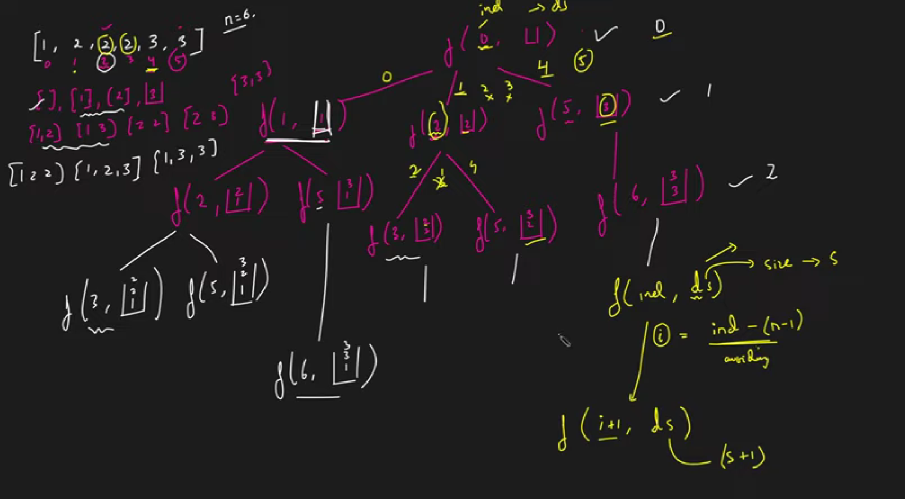

### Question
- Ninja is observing an array of 'N' integers and wants to make as many unique subsets as possible. Can you help him?
- For example {4,3,1} and {1,4,3} are not unique subsets

### Sample Input
    [1,2]
    [1,2,3]

### Sample Output
    0 1 2 3
    0 1 2 3 4 5 6

### Solution
- Sort the input array.Make a recursive function that takes the input array ,the current subset,the current index and  a list of list/ vector of vectors to contain the answer.
- Try to make a subset of size n during the nth recursion call and consider elements from every index while generating the combinations. Only pick up elements that are appearing for the first time during a recursion call to avoid duplicates.
- Once an element is picked up, move to the next index.The recursion will terminate when the end of array is reached.While returning backtrack by removing the last element that was inserted.

### Code
    public static ArrayList<ArrayList<Integer>> uniqueSubsets(int n, int[] arr){
        Arrays.sort(arr);   //to bring together the duplicates side by side
        ArrayList<ArrayList<Integer>> ans=new ArrayList<>();
        findSubsets(0, arr, new ArrayList<Integer>(), ans);
        return ans;
    }

    private static void findSubsets(int ind, int[] arr, ArrayList<Integer> list, ArrayList<ArrayList<Integer>> ans) {
        ans.add(new ArrayList<>(list));
        for (int i = ind; i < arr.length; i++) {
            if (i!=ind && arr[i]==arr[i-1]) continue;   //if duplicate found skip
            list.add(arr[i]);
            findSubsets(i+1, arr, list, ans);
            list.remove(list.size()-1);
        }
    }

### Other Techniques
- We can use Hashset to avoid duplicates

### Complexity
1. Time Complexity - O(2^n*k)
2. Space Complexity - O(2^n*k)