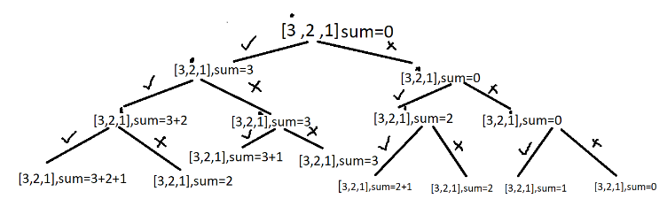

### Question
- You are given an array "num" of n integers
- Return all subset sums of "num" in non-decreasing order

### Sample Input
    [1,2]
    [1,2,3]

### Sample Output
    0 1 2 3
    0 1 2 3 4 5 6

### Solution
- The main idea is that on every index you have two options either to select the element to add it to your subset(pick) or not select the element at that index and move to the next index(non-pick).
- Traverse through the array and for each index solve for two arrays, one where you pick the element,i.e add the element to the sum or don’t pick and move to the next element, recursively, until the base condition. Here when you reach the end of the array is the base condition.

### Code
    public static ArrayList<Integer> subsetSum(int num[]) {
        int n=num.length;
        ArrayList<Integer> sumSubset = new ArrayList<>();
        subsetSumHelper(0,0,num,n,sumSubset);
        Collections.sort(sumSubset);
        return sumSubset;
    }

    static void subsetSumHelper(int ind, int sum, int[] nums, int n, ArrayList<Integer> sumSubset){
        if(ind == n){
            sumSubset.add(sum);
            return;
        }

        //pick
        subsetSumHelper(ind+1, sum+nums[ind], nums, n, sumSubset);

        //not pick
        subsetSumHelper(ind+1, sum, nums, n, sumSubset);
    }

### Edge Cases
- NA

### Other Techniques
- NA

### Complexity
1. Time Complexity - O(2^n)+O(2^n log(2^n))
2. Space Complexity - O(2^n)