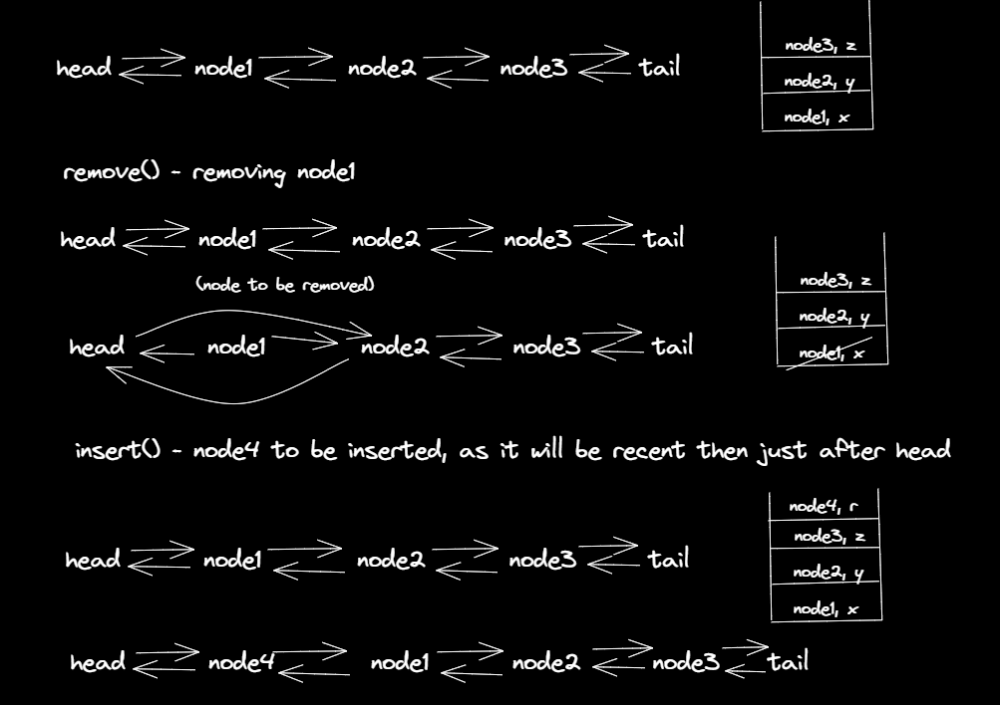

### Question
- Design a data structure that follows the constraints of a Least Recently Used (LRU) cache. 
- Implement the LRUCache class:
  - LRUCache(int capacity) Initialize the LRU cache with positive size capacity. 
  - int get(int key) Return the value of the key if the key exists, otherwise return -1. 
  - void put(int key, int value) Update the value of the key if the key exists. Otherwise, add the key-value pair to the cache. If the number of keys exceeds the capacity from this operation, evict the least recently used key. 
- The functions get and put must each run in O(1) average time complexity.

### Sample Input
    ["LRUCache", "put", "put", "get", "put", "get", "put", "get", "get", "get"]
    [[2], [1, 1], [2, 2], [1], [3, 3], [2], [4, 4], [1], [3], [4]]

### Sample Output
    [null, null, null, 1, null, -1, null, -1, 3, 4]

### Solution
- When we create an instance of LRU Cache DS, we will need three things, a variable which stores capacity of the cache, a hashmap(stores the number as key and Node address as value) and a doubly linked list (head & tail initially pointing to each other)
- The put() will do the following things:
  - Check the hashmap, if the key provided is already present, if yes, remove the element (as we will create a new one to make it as recent)
  - Now check if the size of map==capacity, if yes then we need to remove the least recent one (least recent one is the node attached to prev of tail)
  - then insert the new element
- The get() will do the following things:
  - If the map contains the asked number as key, then we will first get the node of the key and remove it
  - Then we will insert the node again (this is done to make it the most recent one), and return the node's value
  - if the key is not present in map, just return -1
- This is how insert() and remove() works

### Code
    static class Node{
        Node prev, next;
        int key, value;
        Node(int key, int value){
            this.key=key;
            this.value=value;
        }
    }

    private void remove(Node node) {
        map.remove(node.key);
        node.prev.next=node.next;
        node.next.prev=node.prev;
    }

    private void insert(Node node) {
        map.put(node.key, node);
        node.next=head.next;
        node.next.prev=node;
        head.next=node;
        node.prev=head;
    }

    Node head= new Node(0, 0), tail= new Node(0, 0);
    HashMap<Integer,Node> map=new HashMap<Integer, Node>();
    int capacity;

    public LRUCache(int capacity) {
        this.capacity=capacity;
        head.next=tail;
        tail.prev=head;
    }

    public int get(int key) {
        if(map.containsKey(key)) {
            Node node=map.get(key);
            remove(node);
            insert(node);
            return node.value;
        }else {
            return -1;
        }
    }

    public void put(int key, int value) {
        if(map.containsKey(key)) {
            remove(map.get(key));
        }
        if(map.size()==capacity) {
            remove(tail.prev);
        }
        insert(new Node(key, value));
    }

### Edge Cases
- NA

### Other Techniques
- NA

### Complexity
1. Time Complexity - O(1)
2. Space Complexity - O(N)