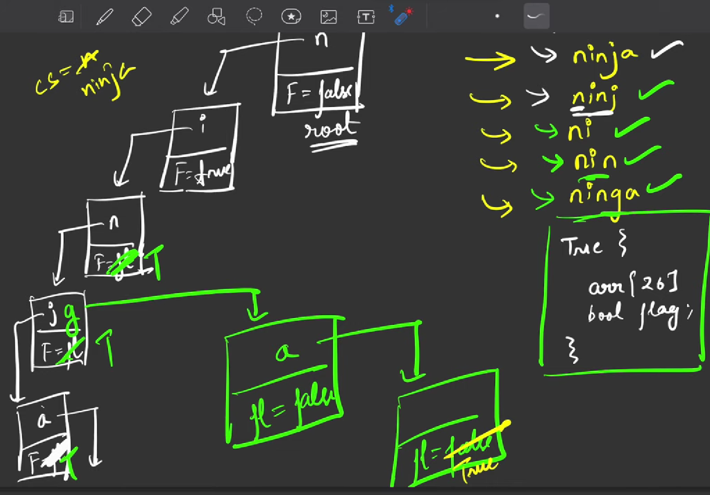

### Question
- Ninja developed a love for arrays and strings so this time his teacher gave him an array of strings, 'A' of size 'N'.
- Each element of this array is a string. The teacher taught Ninja about prefixes in the past, so he wants to test his knowledge.
- A string is called a complete string if every prefix of the string is also present in the array 'A'.
- Ninja is challenged to find the longest complete string in the array 'A'. 
- If there are multiple strings with the same length, return the lexicographically smallest one and if no string exists, return "None"

### Sample Input
    n=6, arr= [n, ni, nin, ninj, ninja, ninga]
    n=2, arr= [ab, bc]

### Sample Output
    ninja
    None

### Solution
- We will create a Trie data Structure, which will have a flag with false, & an array
- We will initially add every string of the array in the trie DS, using insert(), add each character of a string, letter by letter, once the whole string is added, make flag=true
- Now again traverse each string, we will checkIfAllPrefixExists for the given string, then if length of current string is > longest string length, then update longest with current string
- else if both have same length, then we compare lexicographically and then update longest
- checkIfAllPrefixExists()
  - It checks the prefixes exist or not, by going to the references & check if the references have flag as true or not. If the end flag is true, that means this is a valid prefix

### Code
    static class trie{
        boolean isEnd = false;
        trie[] children = new trie[26];
    }

    static trie root;
    public static String completeString(int n, String[] a) {
        root = new trie();
        for(String str : a){
            insert(str);
        }

        String longest = "";
        for(String word : a){
            if(checkIfAllPrefixExists(word)){
                if(word.length() > longest.length()){
                    longest = word;
                }
                else if((word.length() == longest.length()) && word.compareTo(longest) < 0){
                    longest = word;
                }
            }
        }

        return longest == "" ? "None" : longest;
    }

    public static boolean checkIfAllPrefixExists(String word){
        trie node = root;
        boolean flag = true;
        for(char ch : word.toCharArray()){
            if(node.children[ch - 'a'] != null){
                node = node.children[ch - 'a'];
                flag = flag && node.isEnd;
            }
            else return false;
        }
        return flag;
    }

    public static void insert(String word){
        trie node = root;
        for(char ch : word.toCharArray()){
            if(node.children[ch - 'a'] == null){
                node.children[ch - 'a'] = new trie();
            }
            node = node.children[ch - 'a'];
        }
        node.isEnd = true;
    }

### Complexity
1. Time Complexity - O(N) * O(len)
2. Space Complexity - O(N*len)