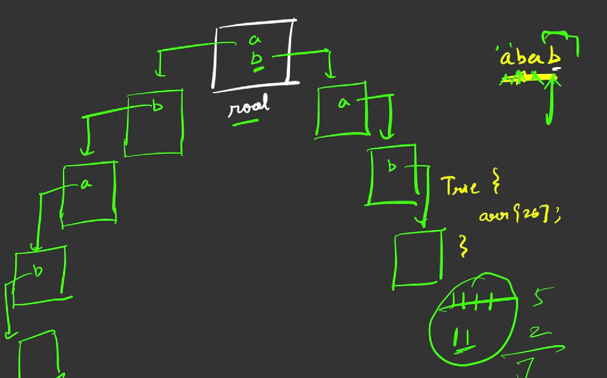

### Question
- Given a string 'S', you are supposed to return the number of distinct substrings(including empty substring) of the given string. 

### Sample Input
    sds
    abc

### Sample Output
    6
    7

### Solution
- The 1st step is to create the trie structure and it generally consists of an array of nodes. Since we are going to have only alphabetic characters in the string, the maximum size of the array will be 26. We can also extend to accommodate upper case letters, if we want. 
- Then, we are going to generate all substrings of the given string. It can be done by 2 nested loops. For each iteration, the outer loop fixes the starting point and the inner loop traverses the substring from the starting point to the end of the string. 
- For each character encountered in the traversal of the inner loop, we are checking whether that particular node in the trie already contains the character or not. 
- If it has, it means that the currently generated substring is a duplicate one. And we can just go to the next iteration to check the next character. But if the current character is not in the current node, then it means that the current substring generated is a brand new one. 
- And we are creating a new node for the latest character. Since it is a new substring, we are increasing the total count.
- Since, the problem also demands to include empty string, we can just add 1(for empty string) to the total counts we got earlier.

### Code
    static class Node {
        Node[] links = new Node[26];
        public Node(){}
        boolean containsKey(char ch){
            return (links[ch-'a']!=null);
        }

        void put(char ch, Node node){
            links[ch-'a']=node;
        }

        Node get(char ch){
            return links[ch-'a'];
        }
    }

    public static int countDistinctSubstrings(String s) {
        Node root= new Node();
        int count=0;
        int n= s.length();
        for (int i = 0; i < n; i++) {
            Node node = root;
            for (int j = i; j < n; j++) {
                if (!node.containsKey(s.charAt(j))){
                    node.put(s.charAt(j), new Node());
                    count++;
                }
                node = node.get(s.charAt(j));
            }
        }
        return count+1;
    }

### Complexity
1. Time Complexity - O(N^2)
2. Space Complexity - hard to predict for tries