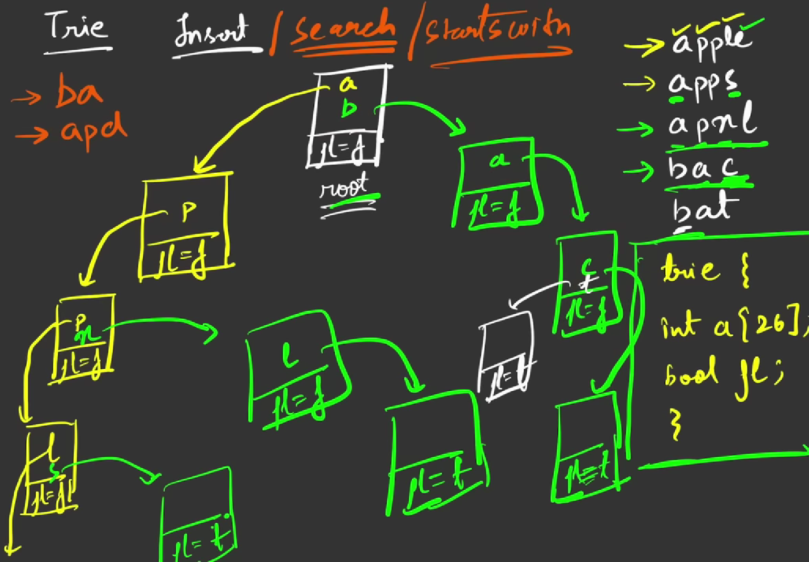

### Question
- A trie (pronounced as "try") or prefix tree is a tree data structure used to efficiently store and retrieve keys in a dataset of strings. There are various applications of this data structure, such as autocomplete and spellchecker. 
- Implement the Trie class:
  - Trie() Initializes the trie object. 
  - void insert(String word) Inserts the string word into the trie. 
  - boolean search(String word) Returns true if the string word is in the trie (i.e., was inserted before), and false otherwise. 
  - boolean startsWith(String prefix) Returns true if there is a previously inserted string word that has the prefix prefix, and false otherwise.

### Sample Input
    ["Trie", "insert", "search", "search", "startsWith", "insert", "search"]
    [[], ["apple"], ["apple"], ["app"], ["app"], ["app"], ["app"]]

### Sample Output
    [null, null, true, false, true, null, true]

### Solution
- Trie struct has 2 variables Node *links[26] (for storing characters); assuming all words have lowercase letters and a bool flag. The flag is always false except when the word ends.
- Insert: The last reference trie’s flag has to be to true since the word is completed. The diagram shows the insertion of the word “apple”. The basic idea of insertion is that if the reference trie does not exist create a new trie and if it does simply traverse to it. 
- Search: Search if the word is present in the trie or not, Start from the root and traverse through the word. while traversing through the word check if the reference trie for that character exists or not. If it exists move to the reference trie, else return false. Once the word is traversed character by character return the flag at that particular trie. 
- startsWith: Check if the word inserted previously has the prefix “prefix” or not. It is similar to a search operation. Start from the root of the trie and traverse through the “prefix”.If the reference trie for a character is not present return false else transverse to the reference trie.Once the “prefix’ is traversed completely character by character return true.

### Code
    static class Node {
        Node[] links= new Node[26];
        boolean flag=false;

        public Node(){}

        boolean containsKey(char ch){
            return (links[ch-'a'] != null);
        }

        Node get(char ch){
            return links[ch-'a'];
        }

        void put(char ch, Node node){
            links[ch-'a']= node;
        }

        void setEnd(){
            flag=true;
        }

        boolean isEnd(){
            return flag;
        }
    }

    private static Node root;
    public Trie() {
        root = new Node();
    }

    public void insert(String word) {
        Node node = root;
        for (int i = 0; i < word.length(); i++) {
            char curr= word.charAt(i);
            if (!node.containsKey(curr)){
                node.put(curr, new Node());
            }
            node = node.get(curr);
        }
        node.setEnd();
    }

    public boolean search(String word) {
        Node node= root;
        for (int i = 0; i < word.length(); i++) {
            if (!node.containsKey(word.charAt(i))){
                return false;
            }
            node = node.get(word.charAt(i));
        }

        return node.isEnd();
    }

    public boolean startsWith(String prefix) {
        Node node = root;
        for (int i = 0; i < prefix.length(); i++) {
            if (!node.containsKey(prefix.charAt(i))){
                return false;
            }
            node = node.get(prefix.charAt(i));
        }
        return true;
    }

### Complexity
1. Time Complexity - O(len)
2. Space Complexity - Hard to predict for Tries